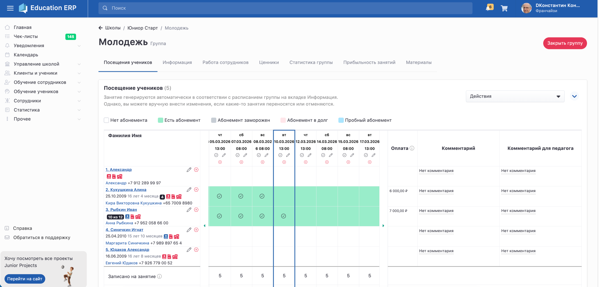

[view:hierarchy=none::::List]

Группа - определённое количество учеников, которые посещают занятия в определённое расписанием время.

Группа может:

-  работать в рамках детского сада,

-  в онлайн режиме

-  быть публичной.

На странице группы содержится следующая информация:

-  Название

-  Основная информация

-  Педагоги

-  Расписание

-  Работа сотрудников

-  Посещение учеников

-  А также посещаемость, домашние задания, материалы для клиентов, конспекты, нормативы

{width=2877px height=1382px}

Расписание публичной группы и возраст учеников можно увидеть на клиентском сайте.

[image:./gruppa-2.png:::0,0,100,100:75::768px:671px:center]