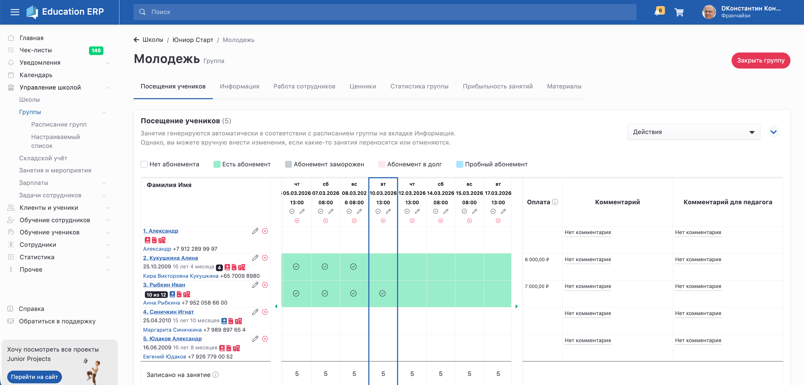

Перейти на страницу группы можно двумя способами:

**1\. Со страницы школы**

-  открыть страницу школы;

-  перейти во вкладку **«Группы»**;

-  нажать на **название группы**.

**2\. Через главное меню**

-  открыть **Управление школой -> Группы**;

-  выбрать нужную группу и нажать на **её название**.

{width=2908px height=1393px}

## Название группы

При создании группы необходимо указать **понятное название**.\
Оно должно быть удобным как для сотрудников школы, так и для клиентов.

Название группы **отображается в личном кабинете клиента**.

---

## Настройка расписания

На странице группы необходимо заполнить **расписание занятий**.

Чтобы добавить расписание, на странице школы должны быть предварительно **созданы** [**помещения**](./../pomeshenie) -- классы или залы, в которых будут проходить занятия.