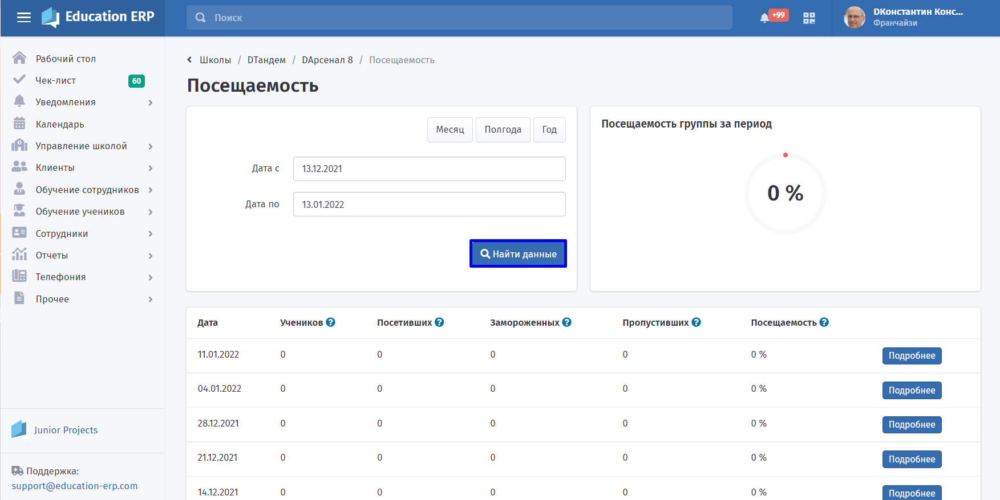
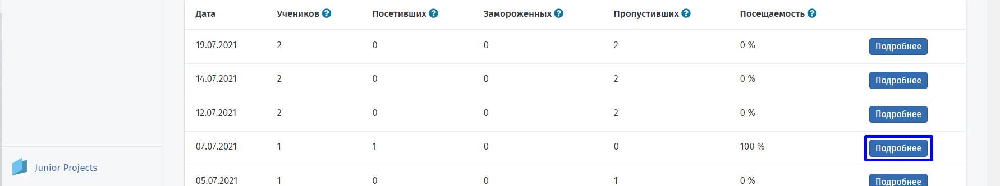
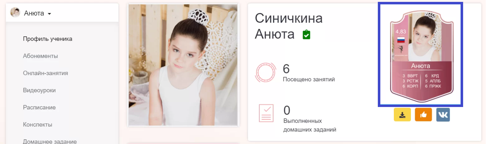
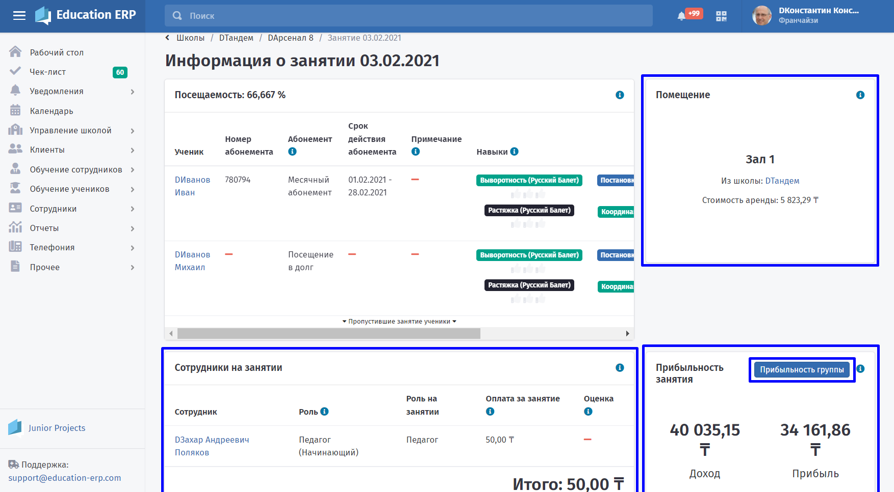

# Посещаемость учеников

Посещаемость выставляется преподавателем вручную. На каждом занятии сотрудник школы отмечает, кто из учеников посетил занятие. По умолчанию ученики должны посещать все занятия в группе, но менеджер школы может сделать исключение и составить для конкретного ученика индивидуальное расписание. Все посещения автоматически записываются на абонемент ученика.

Чтобы посмотреть посещаемость группы или поставить отметку посещения ученику, выберете следующие вкладки: **Управление школой - Группы - Настраиваемый список.**

Затем найдите группу, на которой хотите посмотреть посещаемость. Для этого воспользуйтесь **Настраиваемым списком групп**: введите данные группы и  нажмите кнопку **Применить настройки.** Далее выберете нужную группу.

.png>)

В блоке "**Посещаемость**" на странице группы будут сгенерированы занятия по добавленному [расписанию](./../gruppa/dobavlenie-grupp). Вы сможете [добавлять учеников](./../../../../ucheniki) в группу и ставить им отметки о посещении.

Для быстрого поиска введите сроки проведения активности. Это можно сделать с помощью ввода даты начала и конца активности в поля посещаемости, либо выбора категории посещаемость за месяц, полгода или год.

Откройте страницу с подробной информацией о занятии и посещаемостью учеников с помощью кнопки **"Подробно"** в меню проведения занятия.

**Выставление баллов**

Для выставления баллов отметьте нужное количество баллов каждому посетившему занятие ученику, в соответствии с навыками - скилами, отрабатываемыми на занятии. В личном кабинете клиента будет сгенерирована карточка ученика и проставлены баллы по скилам. Если карточка была сгенерирована ранее, то полученные баллы будут приплюсованы к уже имеющимся. Такой карточкой родители смогут поделиться в социальных сетях и продемонстрировать успехи своего ребёнка.

.jpg>)

Проставьте ученикам отметки за навыки, отрабатываемые на занятии. Они будут увеличивать значения по навыкам-скилам на его карточке в личном кабинете.

**Подробная информация о занятии**

На этой странице будет отображаться статистика посещаемости каждого из учеников выбранного занятия и информация о [абонементе](./../../../../abonementy/vidy-abonementov).

На странице "Подробная информация о занятии" вы также сможете посмотреть:

-  оценки педагогу, который провел занятие и выставил баллы ученикам. Эти оценки проставляют родители из личного кабинета;
-  помещение, в котором было проведено занятие, и его стоимость аренды;
-  прибыльность выбранного занятия или перейти на страницу прибыльности группы в целом.

