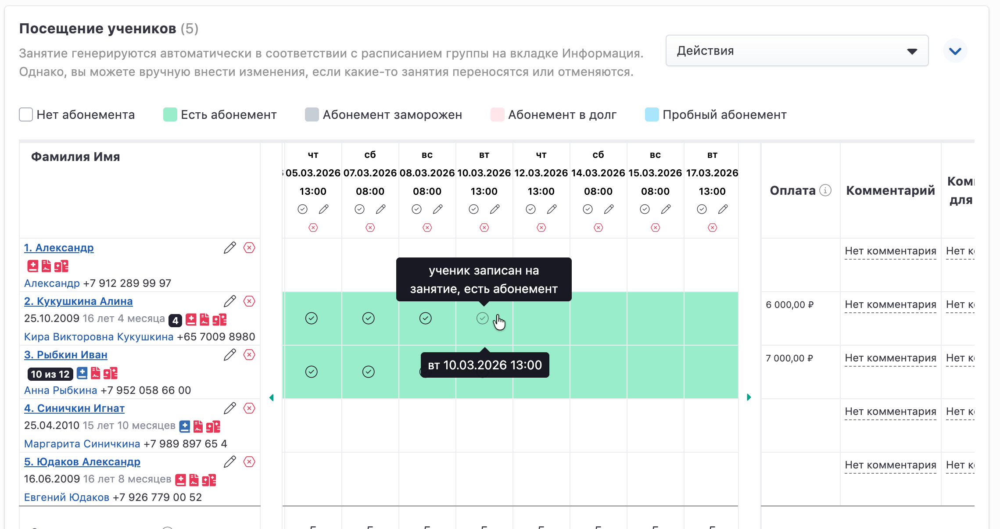
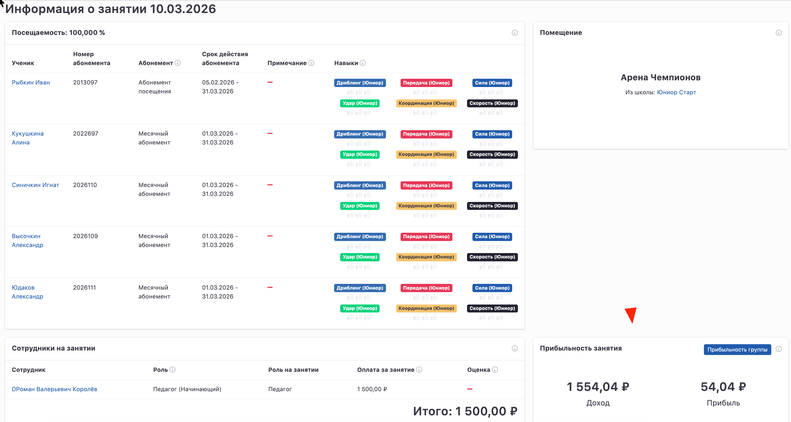

## Посещение учеников

Посещаемость занятий в группе **выставляется преподавателем или сотрудником школы вручную**.

На каждом занятии сотрудник отмечает, **кто из учеников присутствовал на занятии**.\
Все отмеченные посещения автоматически **списываются с абонемента ученика**.

По умолчанию ученики должны посещать **все занятия группы**, но при необходимости менеджер школы может **настроить индивидуальное расписание для конкретного ученика**.

## Как открыть посещаемость группы

Чтобы посмотреть посещаемость или проставить отметки, перейдите:

**Управление школой -> Группы -> Настраиваемый список**

1. Найдите нужную группу через **настраиваемый список групп**.

2. Введите параметры поиска (например, название группы).

3. Нажмите **«Применить настройки»**.

4. Откройте нужную группу.

.png>)

## Блок «Посещение учеников»

На странице группы расположен блок **«Посещение учеников»**.

В этом блоке:

-  автоматически **генерируются занятия по расписанию группы**;

-  отображается **список учеников группы**;

-  можно [**добавлять учеников**](./../../../../ucheniki-2/_index) **в группу**;

-  можно **проставлять отметки посещаемости**.

{width=2279px height=1206px}

## Информация о занятии

Чтобы открыть страницу информации о занятии, нажмите кнопку **дату** занятия.

## Подробная информация о занятии

На странице **«Информация о занятии»** отображаются подробные данные о проведённом занятии: посещаемость учеников, использованные абонементы, навыки, сотрудники, помещение и финансовые показатели.

---

### Посещаемость учеников

В верхней части страницы отображается **процент посещаемости занятия**.

Ниже расположена таблица учеников, записанных на занятие.

В таблице указано:

-  **Ученик** -- имя и фамилия ученика;

-  **Номер абонемента** -- номер абонемента, по которому списывается занятие;

-  **Абонемент** -- тип абонемента;

-  **Срок действия абонемента** -- период действия абонемента;

-  **Примечание** -- дополнительная информация;

-  **Навыки** -- навыки, отрабатываемые на занятии.

Педагог может выставлять ученикам **баллы за навыки (скилы)**.\
Баллы отображаются в **карточке ученика в личном кабинете клиента**.

---

### [Помещение](./../pomeshenie)

В правой части страницы отображается помещение, в котором проходило занятие.

Здесь указывается:

-  название помещения;

-  школа, к которой относится помещение.

---

### [Сотрудники](./../sotrudniki) на занятии

В блоке **«Сотрудники на занятии»** отображаются сотрудники, участвовавшие в проведении занятия.

В таблице указано:

-  сотрудник;

-  его роль;

-  роль на занятии;

-  оплата за занятие;

-  оценка педагога.

Оценки педагогам могут выставлять **родители учеников из личного кабинета**.

В нижней части блока отображается **итоговая сумма оплаты сотрудникам за занятие**.

---

### Прибыльность занятия

В блоке **«Прибыльность занятия»** отображаются финансовые показатели занятия:

-  **Доход** -- сумма, полученная за занятие;

-  **Прибыль** -- разница между доходами и расходами.

Также доступна кнопка **«Прибыльность группы»**, позволяющая перейти к финансовой статистике всей группы.

{width=2488px height=1329px}

Проставьте ученикам отметки за навыки, отрабатываемые на занятии. Они будут увеличивать значения по навыкам-скилам на его карточке в личном кабинете.

