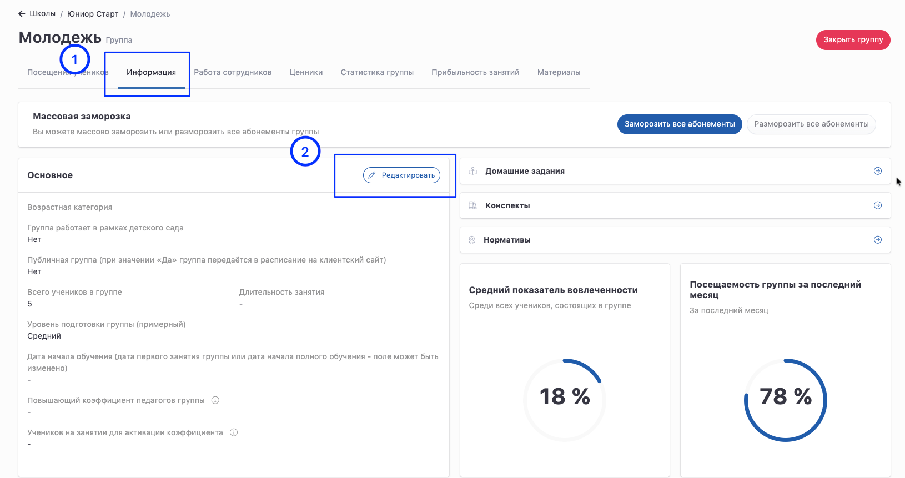
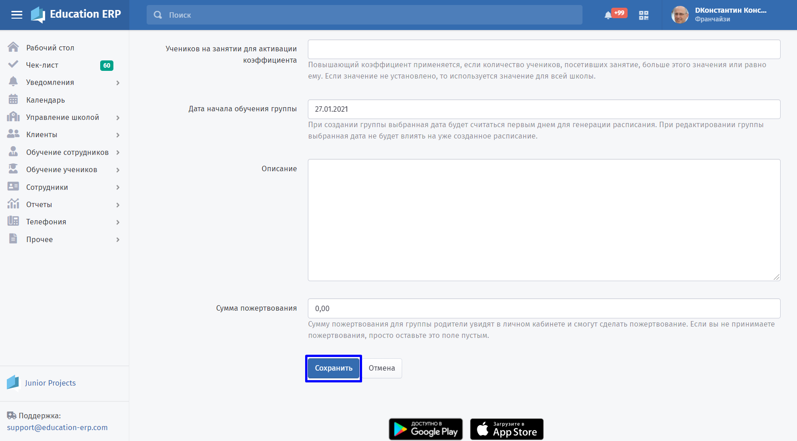
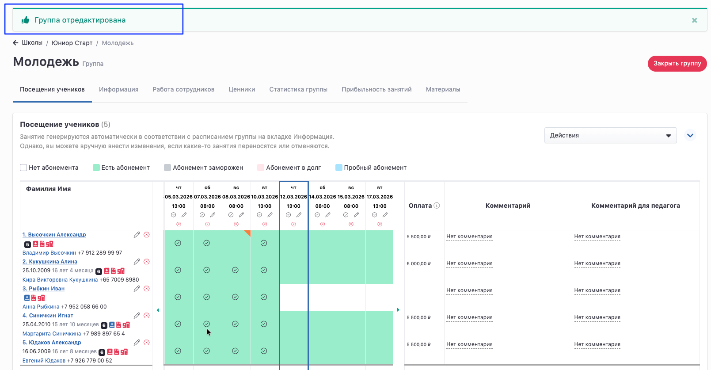

Чтобы изменить основную информацию группы, выполните следующие действия.

### 1\. Откройте список групп

Перейдите в раздел:

**Управление школой -> Группы -> Настраиваемый список**

---

### 2\. Найдите нужную группу

Воспользуйтесь **настраиваемым списком групп**:

-  введите параметры поиска (например, название группы);

-  нажмите кнопку **«Применить настройки»**;

-  в списке выберите нужную группу.

.png>)

:::note 

При редактировании группы **все будущие планы упражнений, назначенные на занятия, будут удалены**.

:::

### 3\. Перейдите к редактированию группы

Откройте выбранную группу и перейдите на вкладку **«Информация»**.

Нажмите на значок **карандаша** для редактирования.

{width=1630px height=861px}

### 4\. Сохраните изменения

Измените необходимые параметры группы и нажмите кнопку **«Сохранить»**.

После успешного редактирования на странице группы появится уведомление **«Группа отредактирована»**.

{width=1609px height=837px}