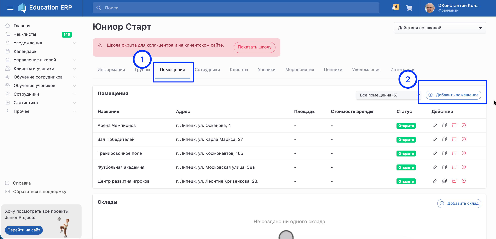

# Помещение

После [регистрации ](./registraciya-shkoly)на странице школы нужно заполнить вкладку «Помещения» -- это классы или залы, где будут проходить занятия.

Для онлайн-школ можно заполнить помещения с 0 стоимостью аренды.

:::info 

Одобрение помещений не требуется. Администратору сети школ поступает информационное уведомление о добавлении нового помещения.

:::

«Помещения» нужны будут на следующем шаге работы с системой в разделе «[Добавление групп».](./gruppa/dobavlenie-grupp)

{width=2906px height=1405px}