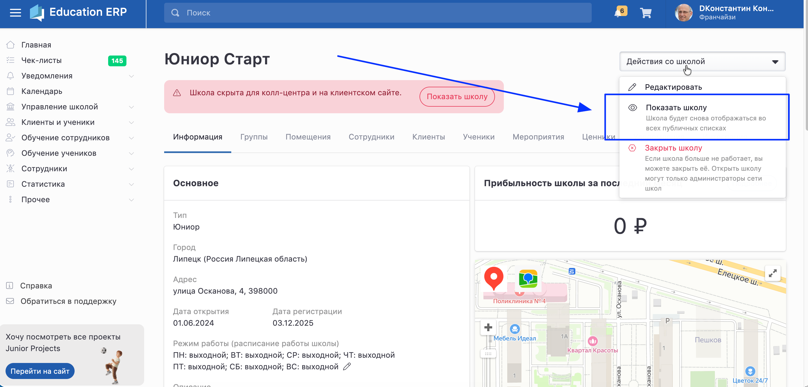

Франчайзи может зарегистрировать школу:

-  через меню **Управление школой - Школы** - «Добавить школу»

-  со страницы своего профиля

 (3).png>)

После отправки заявки на регистрацию школы, её должен одобрить администратор вашей сети школ. Рассмотрение и одобрение заявки занимает около суток. Если одобрение затянулось, можно написать в [техническую поддержку](https://clck.ru/3BYMCJ), по возможности  процесс будет ускорен.

#### **Школа на клиентском сайте**

:::info 

Для получения заявок с[ клиентского сайта](./../../osnovnye-ponyatiya/klientskiy-sayt)  после регистрации следует нажать кнопку  "Показать школу"**.** Тогда клиенты увидят школу и смогут в неё записаться.

Кроме того школа будет доступна во всех [публичных списках](./../../osnovnye-ponyatiya/publichnye-spiski).

А вы получите [уведомление](./../../../uvedomleniya/_index) о новых клиентах.

:::

{width=2914px height=1401px}

:::info 

Если хотя бы в одной из групп школы не будет заполнено расписание, **все группы школы при этом публичные**, школа будет автоматически скрыта.

:::

#### Отправка заявки клиентом и получение уведомления в системе

[video:https://rutube.ru/video/d8e85fe3aee261fd16a4b82a96046ff4/]