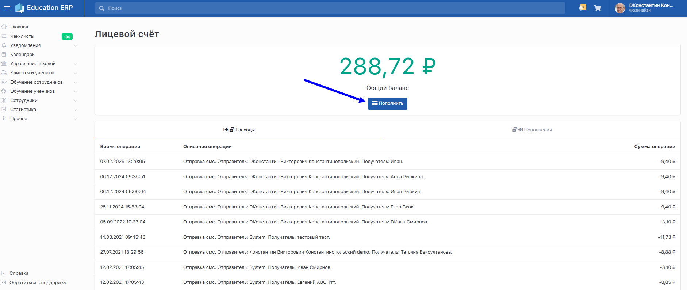
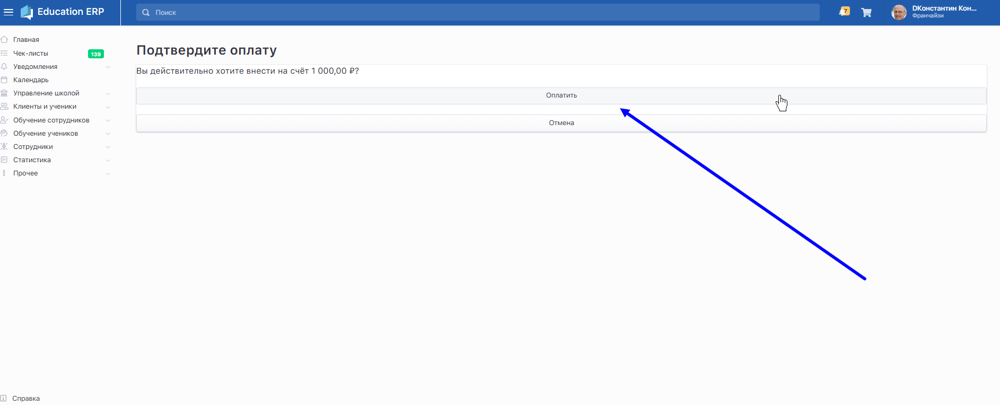

Средства с лицевого счета в сиcтеме Education ERP расходуются на отправку платных смс сообщений при рассылке [уведомлений](https://informa.gitbook.io/education-erp/uvedomleniya). Пополнение лицевого счета доступно только франчайзи.

**Пополнение счёта**

После входа в личный кабинет, **нажмите** на область для аватарки (фотография в правом верхнем углу), затем **выберите** пункт Лицевой счёт.

{width=1895px height=906px}

:::info 

Нажмите «**Пополнить**» -> у кажите сумму к пополнению, **нажмите** кнопку «**Пополнить**».

:::

{width=1882px height=797px}

:::info 

В появившимся окне подтвердите оплату -> «**Оплатить**».

:::

{width=1886px height=764px}

**Введите** данные карты и **нажмите** «**Оплатить**».

:::info 

Отследить расходы и поступления можно на странице Лицевой счёт.

:::

{width=1875px height=797px}

:::info 

Если в школе подключены [страховки](https://informa.gitbook.io/education-erp/klienty/lichnyi-kabinet-klienta/oplata-strakhovki), то 10% от электронной продажи при покупке клиентом из личного кабинета так же поступает на лицевой счёт франчайзи.

Есть случаи-исключения, при которых можно вывести деньги на расчётный счёт.

:::

**Платное СМС**

Чтобы **клиенту** обязательно пришло смс с логином и паролем после покупки абонемента, во вкладке «**Уведомления**» на странице школы нужно включить отправку смc, выбрав стратегию рассылки «Полное покрытие». На момент создания школы все рассылки будут включены, но рассылаться будут только **по бесплатным каналам**.

{width=1878px height=906px}

