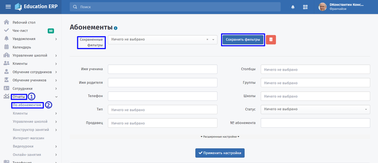
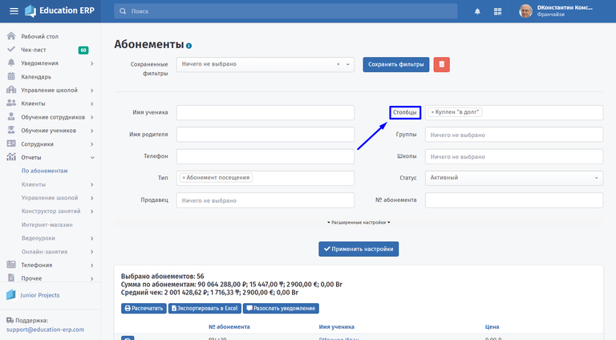
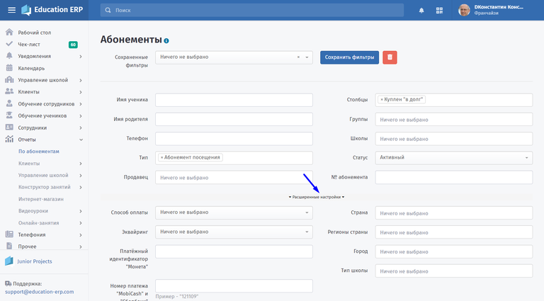
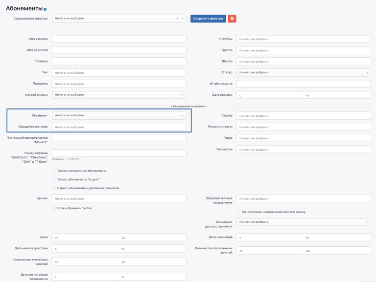

**Отчёты** \- инструмент для составления и фильтрации списков абонементов, благодаря которому в результирующей таблице можно вывести столбцы с любыми необходимыми данными абонементов.

Клиента можно отфильтровать по нескольким фильтрам на станицах **Отчёты - По абонементам.**

**Сохраненные фильтры** позволяют один раз выставить настройки и использовать их для получения быстрого списка в следующий раз, сохраняя созданный фильтр значений.

{width=768px height=332px}

**Столбцы** \- возможность выбрать те данные, которые будут отображены в таблице экпорта Excel с абонементами.

{width=768px height=424px}

**Группа, Школа** \- если у франчайзи несколько школ, то можно сформировать список для одной из них, либо выбрать нужную группу в школе. Поле город также актуально для франчайзи имеющих школы в разных городах.

:::tip 

«Расширенные настройки» позволяют использовать большее число фильтров.

:::

{width=768px height=425px}

:::tip Подробнее

Полученную таблицу можно отправить на печать или экспортировать в файл Excel. Также есть возможность разослать уведомления по выбранному списку абонементов.

:::

В расширенных настройках доступен поиск абонементов по юрлицу и эквайрингу.

{width=768px height=577px}

**Примеры:**

[tabs]

[tab:Абонемент в долг]

Школе нужна статистика количества абонементов, выставленных в долг.

Заполните поле "Тип". В поле "Столбцы" выберете категорию: Куплен в долг. А также статус абонемента.

По кнопке "Применить настройки" сформирован список абонементов в долг.

[/tab]

[tab:Рассылка скидки]

При покупке абонемента по определённому ценнику школа использует рассылку: при посещении абонемента приобретите другой со скидкой 20%

Заполните поле «Тип». В поле «Столбцы» выберете категорию: Скидка. А также статус абонемента.

По кнопке «Применить настройки» сформирован список с абонементами, которым нужно настроить рассылку. Для отправки уведомлений выбранным абонентам нажмите «Разослать уведомления»

[/tab]

[/tabs]

