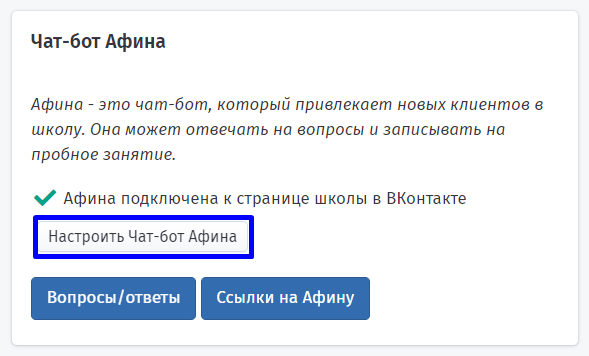
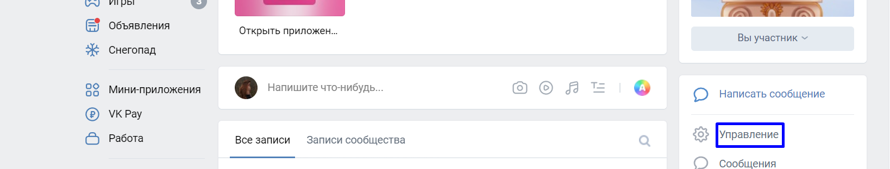
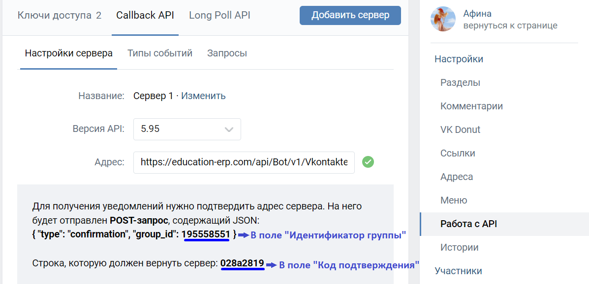
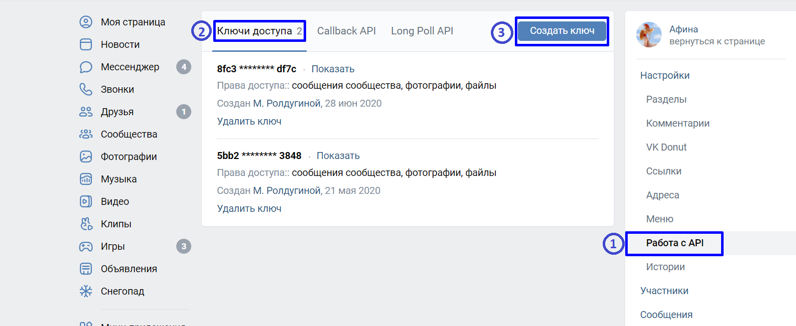
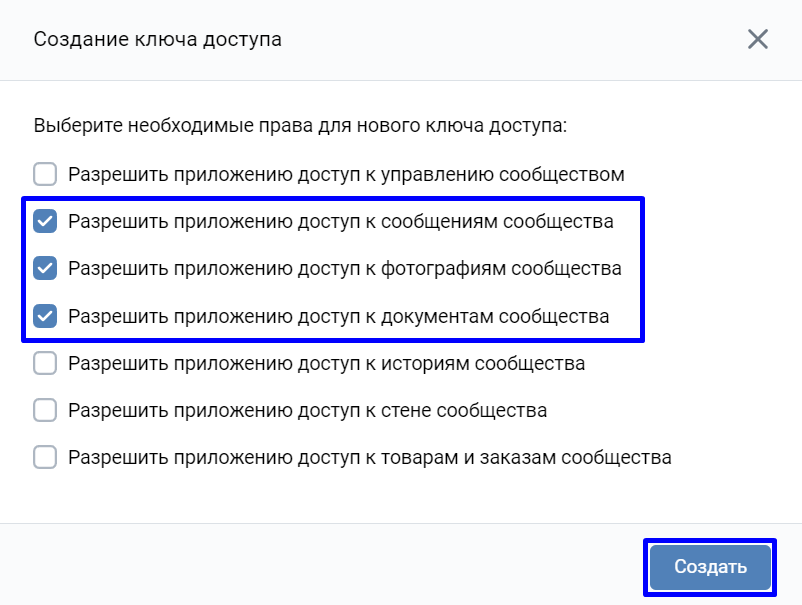
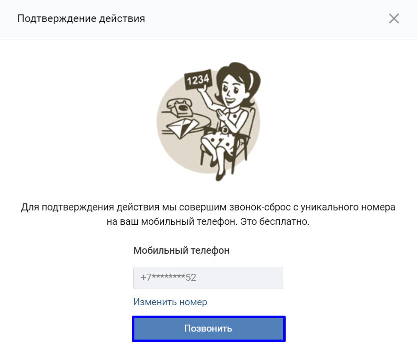
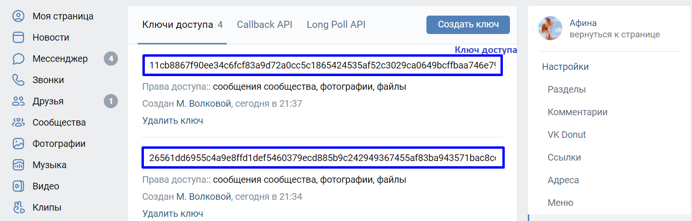
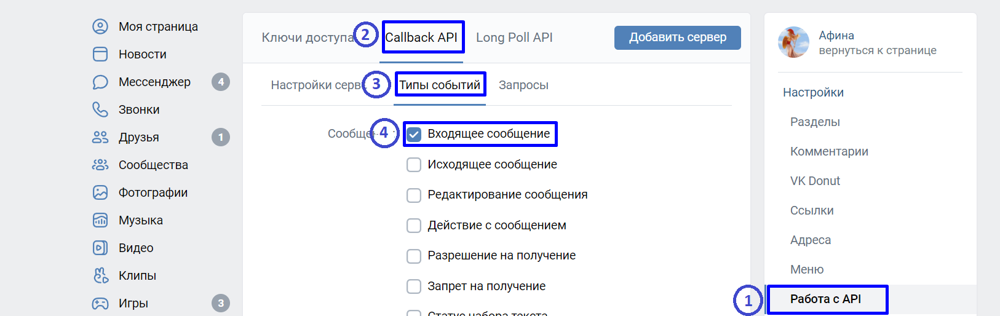
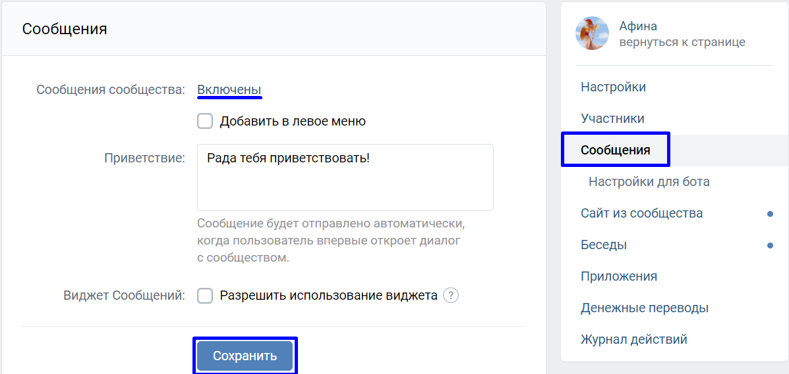

Существует возможность подключить чат-бота Афину к группе (на страницу) вашей школы в социальной сети ВКонтакте.\
Афина будет общаться с посетителями страницы школы, отвечать на вопросы, записывать на пробное занятие и сохранять заявки тренеров на получение работы.\
Подключение чат-бота Афины к группе школы в ВКонтакте осуществляется **бесплатно,** при условии, что Афина уже подключена к вашей школе. Подробнее [здесь](./chto-mozhet-afina).

## Что нужно сделать, чтобы прикрепить чат-бота к группе вашей школы ВКонтакте?

**Базовые настройки страницы ВКонтакте :**

1\. Необходимо нажать кнопку «**Настроить чат-бот Афина**» на странице школы

2\. Далее выберете «**Настройки для Афины**».

.png)

3\. Откройте страницу школы в ВКонтакте.

4\. Перейдите в раздел Управление.

5\. Когда откроется страница с настройками группы, перейдите в раздел 'Работа с API'. На открывшейся странице выберите вкладку 'CallBack API'.

.png)

6\. Внесите данные со страницы в форму ниже. 'group_id' нужно внести в поле 'Идентификатор группы', а 'Строка, которую должен вернуть сервер' нужно внести в поле 'Код подтверждения'. Скриншоты ниже иллюстрируют действия.

**Расширенные настройки страницы ВКонтакте для Афины:**

1. Перейдите на вкладку **Ключи доступа**.

2. Нажмите на кнопку **Создать ключи**.

3\. В открывшемся окне отметьте галками пункты **Разрешить приложению доступ к сообщениям сообщества**, **Разрешить приложению доступ к фотографиям сообщества** и **Разрешить приложению доступ к документам сообщества**, затем нажмите кнопку **Создать**.

4\. Если у вас появилось окно **Подтверждение действия**, выберите **Подтвердить через телефон** и следуйте инструкциям от ВКонтакте.

5\. Внесите полученный ключ доступа в форму ниже в поле **Ключ доступа**.

Далее в **Education ERP** внесите в поле «**Полная ссылка на страницу школы в ВКонтакте**» полную ссылку на страницу школы в ВКонтакте. Пример полной ссылки: https://vk.com/testSchoolPage.

.png)

**Дополнительные инструкции для подключения Афины к странице ВКонтакте.**

1. Перейдите в раздел **Работа с API**, затем откройте вкладку **Callback API** и подвкладку **Типы событий**. Отметьте галкой тип **Входящее сообщение**.

1.  

2. Перейдите в раздел **Сообщения**. Рядом с надписью **Сообщения сообщества** должно быть написано **Включены**. Если это не так, щёлкните по этой надписи и измените состояние на **Включены**, затем нажмите на кнопку **Сохранить**.

   {width=1197px height=569px}

3. Перейдите в раздел **Сообщения**, нажмите **Включить сообщения**.

4. Перейдите в раздел **Настройки** - **Разделы**. Убедитесь, что напротив слова **Фотографии** написано **Открытые** или **Ограниченные**. Если это не так, щелкните по этой надписи и измените состояние на подходящее, затем нажмите на кнопку **Сохранить**.

   .png)

   :::info 

   Фотографии должны быть Ограниченные или Открытые, **НО** **не Выключены**

   :::

5. Перейдите в раздел 'Работа с API', вкладка 'Callback API', подвкладка 'Настройки сервера'. Установите поле 'Версия API' = **5\.95**

.png)

Скопируйте следующую ссылку: https://education-erp.com/api/Bot/v1/Vkontakte?schoolTypeId=1&groupId= и внесите её в поле «Адрес». Нажмите кнопку «Подтвердить». Если вы выполнили все шаги настройки верно, должна появиться надпись в зелёном прямоугольнике 'Адрес сервера успешно сохранён.' Если появилась надпись в красном прямоугольнике 'Сервер вернул неправильный ответ' убедитесь, что вы выполнили все шаги верно.

На этом подключение чат-бота Афины к странице вашей школы в ВКонтакте завершено! Попробуйте написать сообщение странице вашей школы, и вам ответит Афина. Если ответ не поступит, убедитесь, что вы выполнили все шаги настройки верно. Вы можете вернуться к настройкам Афины для страницы школы в ВКонтакте, нажав на кнопку 'У меня все получилось' внизу этой страницы. Скриншоты ниже иллюстрируют действия.

.png)

:::info 

Если по какой-то причине у Вас не получилось настроить чат-бот Афину, напишите на [support@education-erp.com ](mailto:support@education-erp.com?body=%D0%9F%D0%BE%D0%B6%D0%B0%D0%BB%D1%83%D0%B9%D1%81%D1%82%D0%B0%20%D0%BD%D0%B5%20%D0%B7%D0%B0%D0%B1%D1%8B%D0%B2%D0%B0%D0%B9%D1%82%D0%B5%20%D1%83%D0%BA%D0%B0%D0%B7%D0%B0%D1%82%D1%8C%20%D1%82%D0%B5%D0%BC%D1%83%20%D0%BF%D0%B8%D1%81%D1%8C%D0%BC%D0%B0.%0D%0A%20%0D%0A%20%D0%95%D1%81%D0%BB%D0%B8%20%D0%B2%D1%8B%20%D1%81%D1%82%D0%BE%D0%BB%D0%BA%D0%BD%D1%83%D0%BB%D0%B8%D1%81%D1%8C%20%D1%81%20%D0%BF%D1%80%D0%BE%D0%B1%D0%BB%D0%B5%D0%BC%D0%BE%D0%B9,%20%D0%BF%D0%BE%D0%B6%D0%B0%D0%BB%D1%83%D0%B9%D1%81%D1%82%D0%B0,%20%D0%BC%D0%B0%D0%BA%D1%81%D0%B8%D0%BC%D0%B0%D0%BB%D1%8C%D0%BD%D0%BE%20%D0%BF%D0%BE%D0%B4%D1%80%D0%BE%D0%B1%D0%BD%D0%BE%20%D0%BE%D0%BF%D0%B8%D1%88%D0%B8%D1%82%D0%B5%20%D0%B5%D0%B5.%0D%0A%20%D0%A7%D0%B5%D0%BC%20%D0%B1%D0%BE%D0%BB%D0%B5%D0%B5%20%D0%BF%D0%BE%D0%B4%D1%80%D0%BE%D0%B1%D0%BD%D0%BE%D0%B9%20%D0%B8%20%D0%B4%D0%B5%D1%82%D0%B0%D0%BB%D1%8C%D0%BD%D0%BE%D0%B9%20%D0%B1%D1%83%D0%B4%D0%B5%D1%82%20%D0%B8%D0%BD%D1%84%D0%BE%D1%80%D0%BC%D0%B0%D1%86%D0%B8%D1%8F,%20%D1%82%D0%B5%D0%BC%20%D0%B1%D1%8B%D1%81%D1%82%D1%80%D0%B5%D0%B5%20%D0%BC%D1%8B%20%D1%81%D0%BC%D0%BE%D0%B6%D0%B5%D0%BC%20%D0%B2%D0%B0%D0%BC%20%D0%BF%D0%BE%D0%BC%D0%BE%D1%87%D1%8C.%0D%0A%20%D0%AF%20%D0%B4%D0%B5%D0%BB%D0%B0%D1%8E%20%D1%81%D0%BB%D0%B5%D0%B4%D1%83%D1%8E%D1%89%D0%B5%D0%B5:%0D%0A%201.%0D%0A%202.%0D%0A%203.%0D%0A%20%D0%9F%D1%80%D0%BE%D0%B8%D1%81%D1%85%D0%BE%D0%B4%D0%B8%D1%82%20%D0%B2%D0%BE%D1%82%20%D1%87%D1%82%D0%BE:%0D%0A%20%0D%0A%20%D0%AF%20%D0%BE%D0%B6%D0%B8%D0%B4%D0%B0%D1%8E:%0D%0A%20%0D%0A%20%0D%0A%20____________________________%0D%0A%20%D0%A2%D0%B5%D1%85%D0%BD%D0%B8%D1%87%D0%B5%D1%81%D0%BA%D0%B0%D1%8F%20%D0%B8%D0%BD%D1%84%D0%BE%D1%80%D0%BC%D0%B0%D1%86%D0%B8%D1%8F%20(%D0%9D%D0%B5%20%D1%83%D0%B4%D0%B0%D0%BB%D1%8F%D1%82%D1%8C)%20:%0D%0A%20%20D%D0%B8%D0%BC%D0%B0%20%D0%94%D0%B8%D0%BC%D0%B0%20%D0%A4%D1%80%D0%B0%D0%BD%D1%87%D0%B0%D0%B9%D0%B7%D0%B8%20+7%20999%20999%2099%2099%20(13948)%0D%0A%20%20http://education-erp.com/ru/SchoolAfinaBot/VkGroupInstructions?schoolId=10229%20%7C%20%0D%0A%20____________________________)и мы обязательно поможем.

:::