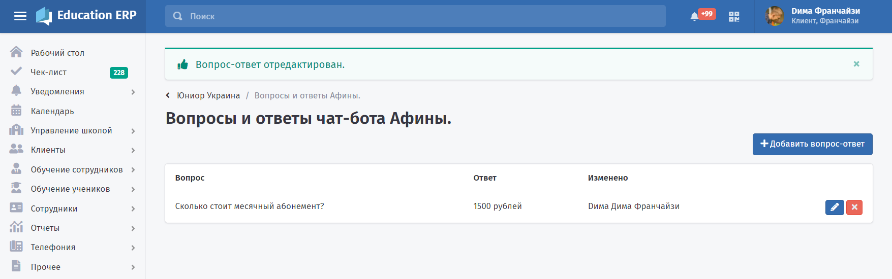
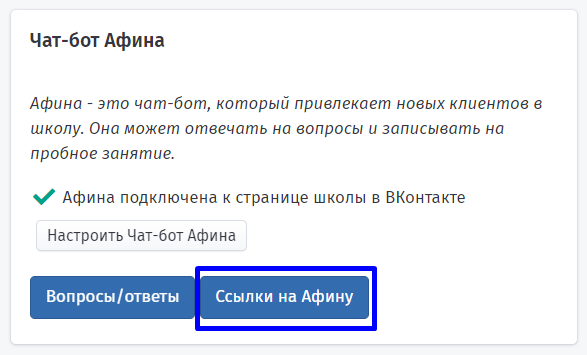
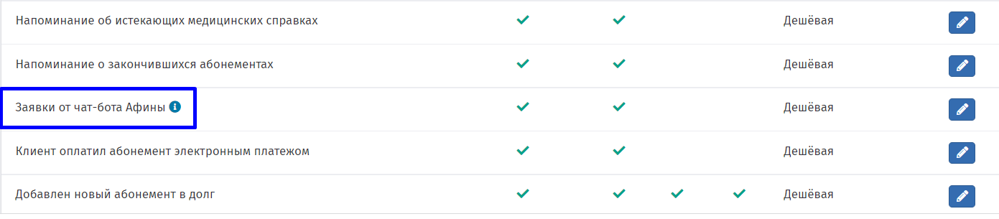

Афина ответит на часто задаваемые вопросы, подберёт школу клиенту, запишет на пробное занятие. Афина соберёт всю необходимую информацию о клиенте и создаст клиента передаст её оператору в выбранную школу.

[image:../.gitbook/assets/____________________________ios%20(1).png:::0,0,100,100:27]

[image:../.gitbook/assets/____________________________ios%20(2).png:::0,0,100,100:28]

После регистрации вашей школы в системе Education ERP чат-бот "Афина" уже подключён к вашей школе. Можно начинать им пользоваться.

.png)

На странице **«Вопросы и ответы чат-бота Афины»** есть возможность добавить ответы на часто задаваемые вопросы клиентов, либо изменить или удалить созданный ранее "вопрос-ответ".

:::info 

**Обратите внимание**, что вопросы нужно добавить для каждой школы.

:::

Актуальный список ссылок для рекламы можно увидеть\
в разделе "**Ссылки на Афину**" на странице школы\
в блоке "**Чат-бот Афина**"

Вы можете прикрепить чат-бота к группе вашей школы ВКонтакте. Для этого необходимо нажать кнопку "**Настройки для Афины**" на странице школы и следовать дальнейшим инструкциям.

.png)

Для получения уведомлений о заявках клиентов от Афины включите, выберите стратегию и канал рассылки в блоке «[**Уведомления**](./../uvedomleniya/_index)» на странице каждой школы.

