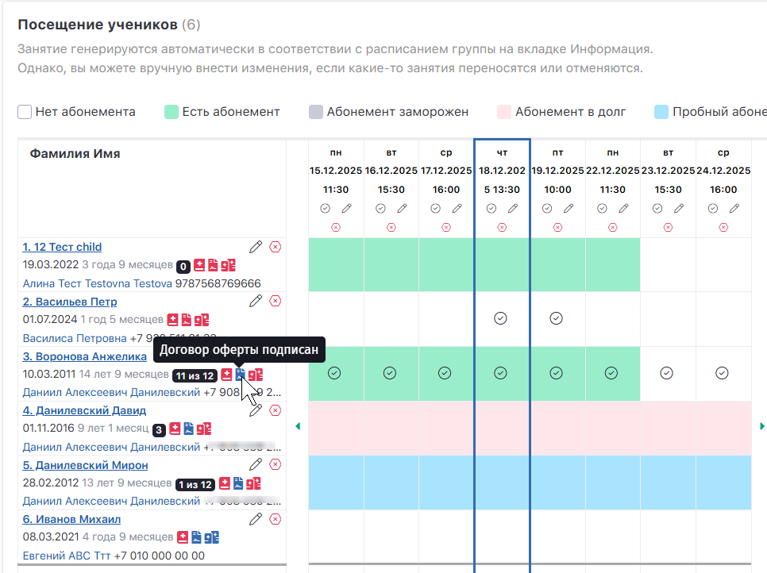

## Зачем проверять статус договора

Договор оферты и политика конфиденциальности принимаются клиентом в личном кабинете. В Education ERP вы можете быстро проверить статус принятия:

-  точечно -- по конкретному ученику в группе,

-  массово -- через фильтр по базе клиентов.

## Способ 1. Проверка на странице группы (быстро во время работы с посещаемостью)

Откройте нужную группу ->  вкладка: **Посещение учеников**

В строке каждого ученика (в ячейке рядом с данными ученика) отображаются служебные значки, в том числе по документам.

-  **Синий значок договора** означает, что договор оферты **подписан** (принят) в личном кабинете клиента.

-  **Красный значок договора** означает, что договор **не подписан** (не принят).

:::quote 

При наведении курсора на значок появляется текстовая подсказка (договор подписан/не подписан).

:::

{width=966px height=722px}

### Когда этот способ удобнее

-  тренер/фронт-менеджер отмечает посещаемость и хочет сразу понимать статус документов;

-  нужно быстро проверить конкретного ученика.

---

## Способ 2. Проверка через список клиентов (массовая выборка по школе/статусу)

Этот способ подходит, если нужно:

-  найти всех клиентов, кто **не принял** договор,

-  собрать выборку по школе,

-  подготовить список для обзвона/рассылки.

### Шаг 1. Откройте список клиентов

Перейдите в меню: **Клиенты и ученики -> Все клиенты**

### Шаг 2. Откройте расширенные настройки фильтра

На странице списка клиентов раскройте **Расширенные настройки** (раздел с дополнительными фильтрами).

### Шаг 3. Установите фильтр по договору

Найдите параметр:\
**«Принят договор оферты и политика конфиденциальности»**

Выберите нужное значение:

-  **Принят** -- чтобы увидеть клиентов, у которых документы уже подтверждены

-  **Не принят** -- чтобы увидеть клиентов, которым нужно принять документы

### Шаг 4. Примените фильтр

Нажмите: **Применить настройки**

### Результат

В списке отобразятся клиенты, подходящие под выбранный статус.\
Дальше можно работать с ними (связаться, подсказать, где принять документы и т.д.).

---

## Практические рекомендации

-  Если вы работаете “в моменте” (перед занятием, на входе) -- используйте **проверку в группе**.

-  Если нужно навести порядок по школе или подготовить список клиентов “в работе” -- используйте **фильтр в «Все клиенты»**.

-  Проверку особенно полезно делать:

   -  перед запуском онлайн-оплат,

   -  при первичном зачислении в группу,

   -  перед мероприятиями/поездками, где важна юридическая фиксация документов.