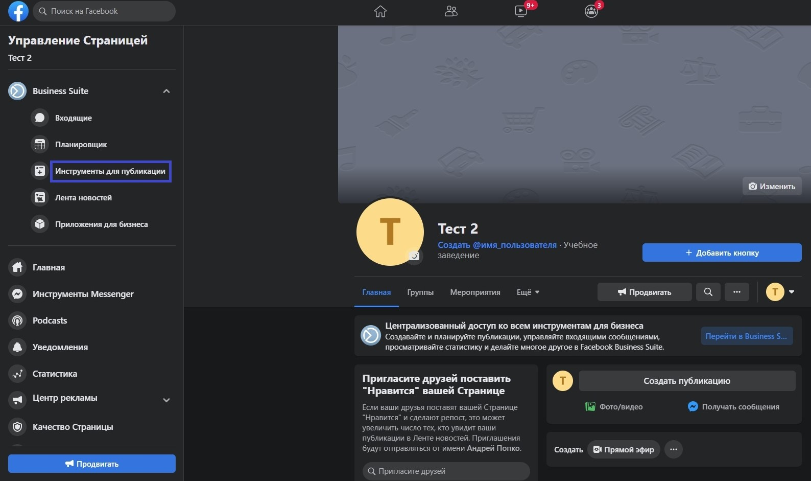

# Как настроить?

1\. Перейдите на страницу вашей организации на Facebook и в меню управления страницей (слева) нажмите «Инструменты для публикации»

2\. В меню слева выберите «Моментальные формы» (подраздел «Разместить рекламу»).&#x20;

3\. Далее выберете пункт "Новая форма".

4\. В окне создания формы выберите сначала «Настройки» и указываем язык «Русский».

5\. Вернитесь в «Контент» и укажите название формы (произвольно). Затем, в «Тип формы» выберите «Повышение объема»

В разделе «Краткая информация» вы можете вставить фоновое изображение и указать приветствие для формы по вашему усмотрению.

**Перейдите к разделу «Вопросы», где вам необходимо настроить поля для заполнения в форме (эти же поля будут отправляться к нам в ERP-систему).**

****

**6.** Нажмите «Добавить вопрос» и во всплывающем окне выберите «Короткий ответ».

6.1. В качестве вопроса указываем «Имя ребенка». Это значение будет передаваться далее в Education ERP.

6.2.Опуститесь на странице чуть ниже, в подраздел «Предварительно заполнить вопросы».

В начале необходимо заполнить «Описание» - информацию о том, как вы будете использовать и передавать информацию. В качестве шаблонного вы можете указать: «_Мы используем вашу информацию, чтобы сообщать актуальную информацию о наших продуктах и услугах_», либо указать свой вариант.

Затем, под полями «Электронный адрес» и «Полное имя», которые также будут отправляться в Education ERP, необходимо нажать «Добавить категорию».

Во всплывающем меню необходимо выбрать «Поля с контактной информацией» - «Номер телефона».

6.3. После добавления ссылки перейдите к подразделу «Завершение», который располагается ниже подраздела «Конфиденциальность». В данном подразделе все заполняется произвольным образом за исключением поля «Ссылка». В него вам **обязательно** нужно вставить ссылку на вашу организацию. Например, ссылку на страницу вашей организации в Facebook.

6.4. Перейдите на страницу вашей организации в Facebook и в меню управления страницей (слева) нажмите «Инструменты для публикации»

.jpg>)

6.5. Переходим к проверке формы, в которой данные будут передаваться в Education ERP:\
\
Для этого в окне «Создание формы» перейдите в раздел «Настройки» и выберите «Названия полей».\
\
Заполните поля следующим образом:

* _Имя\_ребенка_ – **child\_name**
* _Эл. адрес_ - **email**
* _Полное имя_ - **full\_name**
* _Номер телефона_ - **phone\_number**

.jpg>)

7\.&#x20;

8\.&#x20;

9\.&#x20;

10\. Перейдите в подраздел «Параметры отслеживания» и в качестве «Названия параметра» укажите **school\_Id**, в качестве «Значения параметра» **обязательно** указываем id школы (Чтобы его узнать, перейдите на страницу вашей школы в Education ERP и скопируйте цифры из ссылки. Также, вы можете найти id на странице «Управления интеграцией с Facebook» - блок находится на странице школы).\
\
Если ничего не было пропущено, то можно нажать кнопку «Опубликовать».

