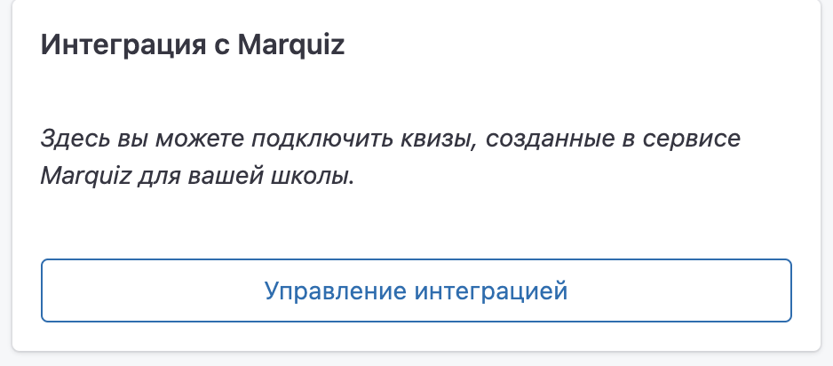
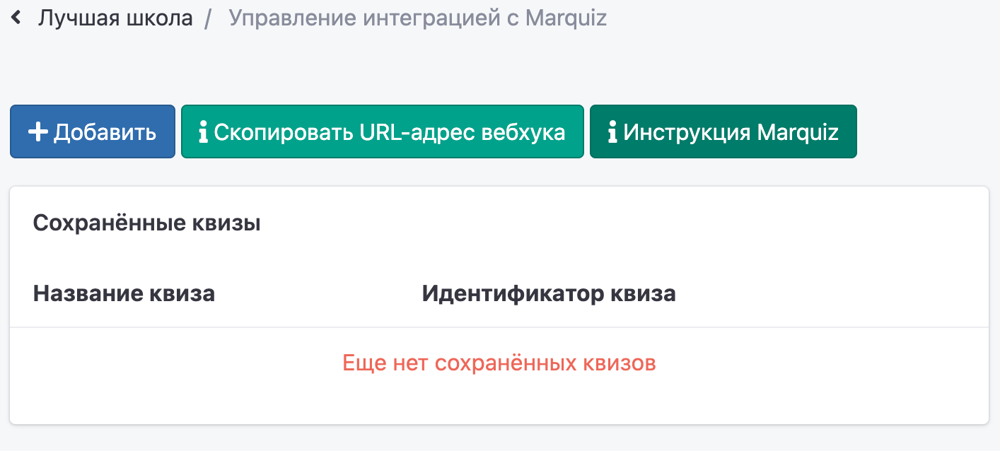
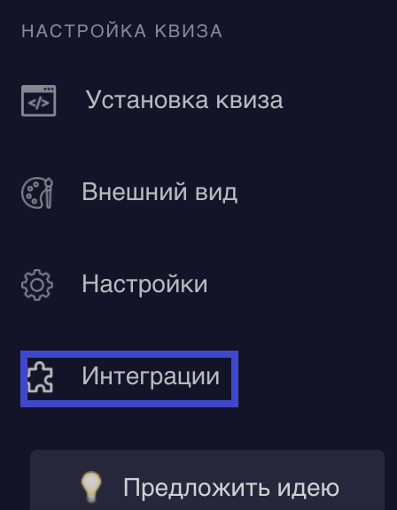
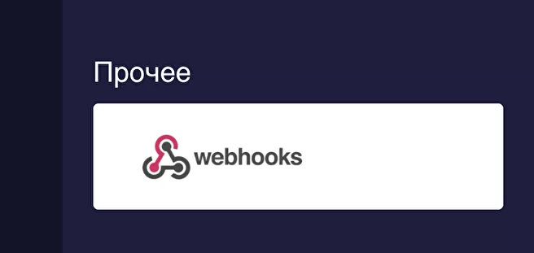
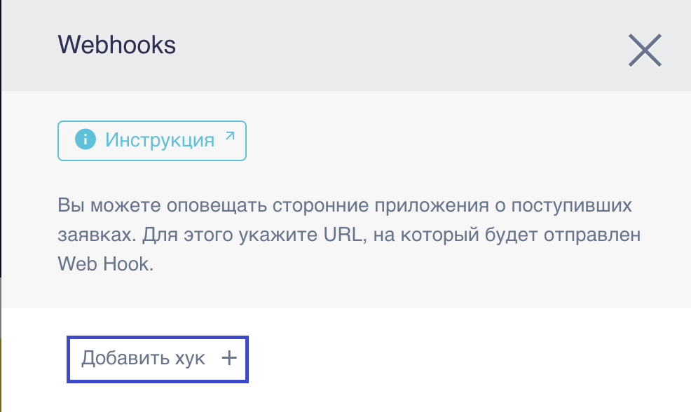
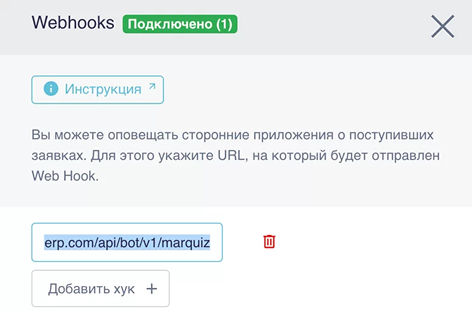
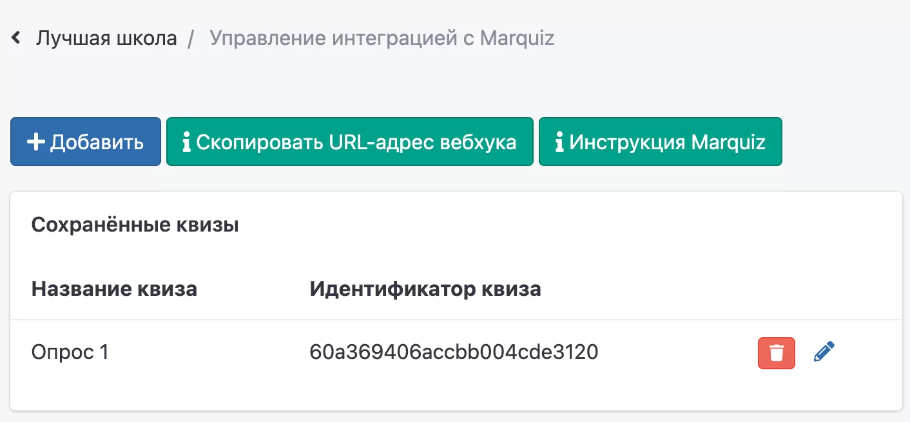

# Как установить?

**1.** На странице школы в блоке Интеграция с Marquiz нажмите на кнопку "Управление интеграцией".

**2.** На странице управления интеграцией с Marquiz в Education ERP нажмите на кнопку "Скопировать URL-адрес вебхука".

**3.** Перейдите в ваш аккаунт в Marquiz. На странице квизов в панели Marquiz выберите квиз, который хотите интегрировать со школой и нажмите на кнопку "Редактировать". &#x20;

.png>)

**4.** После того как вы перешли на страницу редактирования квиза, в меню слева выберите пункт под названием Интеграции, он находится в разделе Настройка квиза.

&#x20;

**5.** Чуть ниже на странице, в разделе Интеграции, найдите раздел Прочее и нажмите кнопку webhooks.

**6.** После того как вы нажали на кнопку webhooks у вас откроется справа боковая панель, где вам необходимо нажать на кнопку Добавить хук.&#x20;

**7.** В появившемся поле вставьте тот URL-адрес вебхука, который вы скопировали из ERP.

**8.** Далее нажмите на крестик в правом верхнем углу и обязательно нажмите Сохранить на панели, которая находится в нижней части страницы..png>)

**9.** В левом боковом меню выберите пункт Установка квиза, который находится в разделе Настройка квиза.

**10.** После того как вы нажали на Установка квиза у вас откроется страница с окошком, где нужно скопировать ссылку на квиз, нажав кнопку копирования (см. скриншот).

**11.** Далее перейдите на страницу Управление интеграцией с Marquiz в Education ERP и нажмите на кнопку "Добавить".

**12.** Впишите название вашего квиза в поле Название квиза, а в поле Идентификатор квиза вставьте ссылку квиза, которую вы копировали в панели Marquiz.

**13.** Сохраненный квиз вы увидите в общем списке и сможете отредактировать его или удалить при необходимости. Система сама сохранит только идентификатор квиза.

``

<mark style="color:green;">**`Для одной и той же школы можно прикрепить несколько квизов, но для нескольких школ прикрепить один и тот же квиз нельзя.`**</mark>

****

Также **** обратите внимание, что поля Имя и Телефон должны быть обязательными для заполнения в вашем опросе Marquiz.\
\
Самостоятельно пройдите квиз и перейдите на страницу ERP\
[Клиенты](../../klienty/) -> Новые в Education ERP (education-erp.com), чтобы убедиться, что ваша тестовая заявка из квиза попала в систему.\
\
Если на этой странице вы не нашли свою заявку, то пользователь с таким номером уже существует в системе, нужно воспользоваться поиском по номеру телефона, чтобы найти его.
