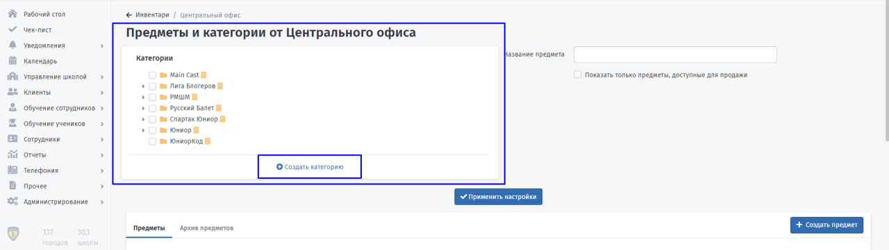
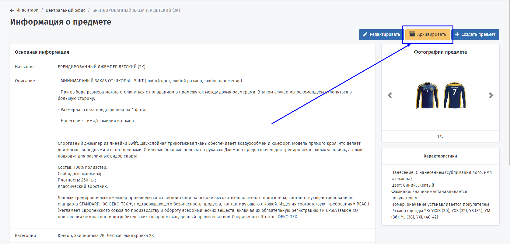
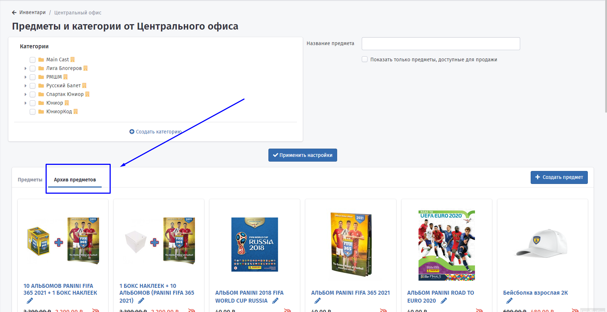

# Складской учёт


Для того, чтобы товары отображались в личном кабинете у клиентов и они могли оформлять заказ, предметы необходимо добавлять с сайта [https://shop.fsjunior.com/](https://shop.fsjunior.com/) в систему Education ERP.&#x20;


#### Добавлять и удалять позиции необходимо самостоятельно вручную. Добавление, удаление и редактирование предметов в Education ERP доступно для пользователей с ролью Суперадминистратор. Для запроса соответствующей роли необходимо обратиться в поддержку по адресу support@education-erp.com

#### Пополнение предметов интернет-магазина доступно только для сотрудников Центрального офиса.

### Предметы и категории от Центрального офиса

На странице Управление школой-Складской учёт-Центральный офис необходимо добавлять предметы, которые будут доступны для продажи от Центрального офиса.

Предметы в  Education ERP добавляются согласно структуре сайта [https://shop.fsjunior.com/](https://shop.fsjunior.com/)&#x20;

Категории - повторяют данную структуру. Если какой-то категории не хватает, то ее необходимо добавить.

Для добавления категории перейти в "**Создать категорию**".&#x20;

Указать:

* название категории
* тип школы, для которой данная категория добавляется
* категорию, внутри которой появится ваша.

<figure><figcaption></figcaption></figure>

Для добавления нового предмета нужно перейти в "Создать предмет"

<figure><figcaption></figcaption></figure>

В открывшемся окне заполнить все поля.

1. **Название предмета.**
2. **Добавить фото предмета**. Обратите внимание, что в качестве превью будет показываться первая фотография. После загрузки фото возможно их расположить в нужном порядке.
3. **Заполнить описание предмета.**
4. **Выбрать подходящую категорию.**
5. **Указать характеристики.** Необходимо добавлять каждую отдельную характеристику. Значения характеристики прописываются с новой строки. Чтобы покупатель сам мог ввести нужное ему значение при заказе предмета - оставьте поле значений пустым. Если при каком-либо значении характеристики цена предмета должна увеличиваться, сначала напишите значение характеристики, затем поставьте точку с запятой и введите наценку за это значение характеристики числом.
6. **Группы.** Есть возможность выбрать необходимую группу, но не является обязательным.
7. **Ссылка на страницу в интернет-магазине**. Добавить ссылку с интернет магазина [https://shop.fsjunior.com/](https://shop.fsjunior.com/) для быстрого поиска предмета в дальнейшем.
8. **Цена без скидки**. Указать цену из интернет-магазина.
9. **Скидка (в процентах)**. При указании процента Цена со скидкой автоматически меняется.
10. **Цена со скидкой**. При указании цены, автоматически меняется процент скидки.
11. **Запретить показ предмета клиентам.** При установки данной отметки клиенты не увидят сразу предмет и не смогут его заказать. В дальнейшем, франчайзи сможет добавить индивидуально для себя этот товар и сам будет решать, отображать для клиентов предмет или нет.


Если цена меняется на сайте [https://shop.fsjunior.com/](https://shop.fsjunior.com/), то её необходимо вручную корректировать в Education ERP.


Предмет можно **Удалить** или **Архивировать**. Возможность удалить предмет сохраняется, если он не добавлен франчайзи для продажи, его ни разу не заказывали, в остальных случаях позицию можно **Архивировать**.

Чтобы отправить предмет в архив необходимо войти в него и нажать **Архивировать**.

<figure><figcaption></figcaption></figure>

Заархивированные предметы доступны на главной странице **Предметы и категории от Центрального офиса** в **Архиве предметов**.

<figure><figcaption></figcaption></figure>

Чтобы вернуть предмет из архива необходимо в **Архиве предметов** перейти в нужный товар и нажать **Разархивировать**.

<figure><figcaption></figcaption></figure>
