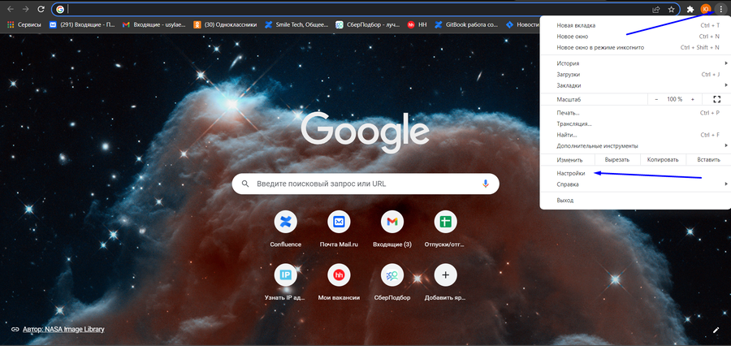
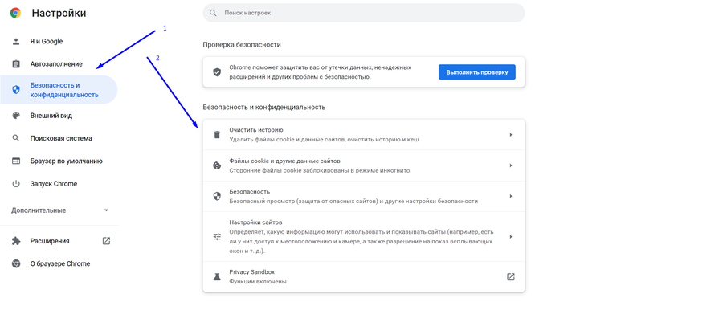
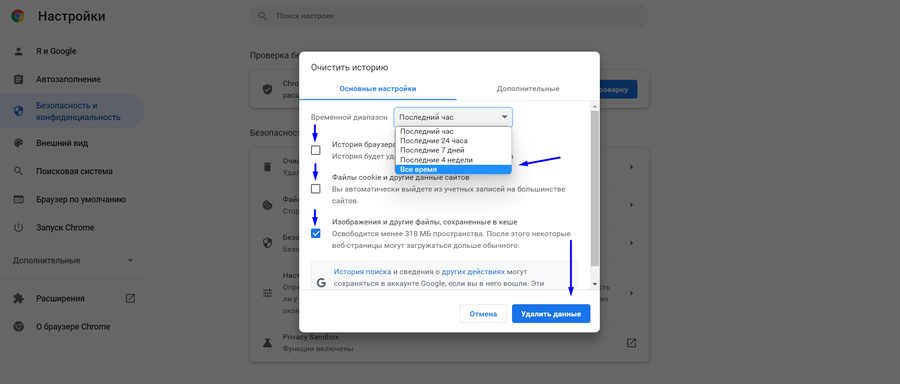
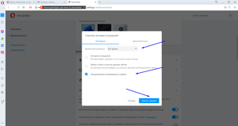
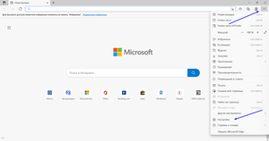
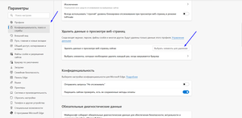
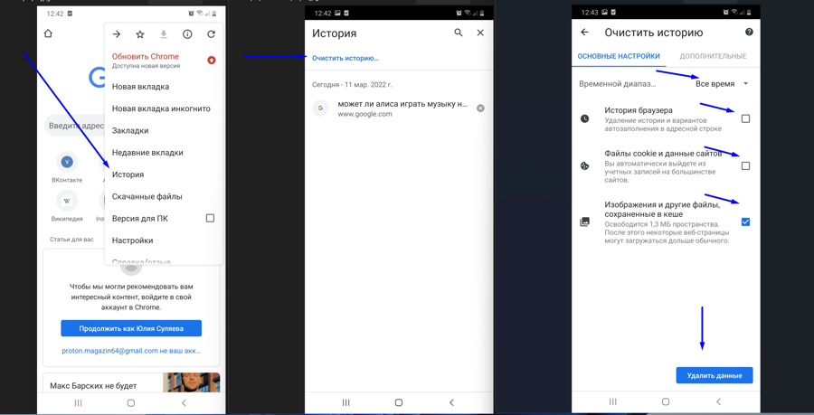
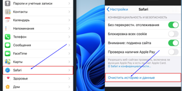

Кэш (cache) браузера -- это копии страниц, картинок, видеороликов и прочих материалов, которые вы посмотрели с помощью браузера. Кэш помогает экономить время на открытие страниц: если страница, которую вы смотрите, уже есть в кэше, браузер мгновенно откроет её.

Иногда кэшированные файлы препятствуют отображению актуального содержимого сайтов, так как загружаются устаревшие сохраненные данные, поэтому имеет смысл время от времени очищать кэш.

**!** При неправильной работе сайтов и приложений первым делом стоит очистить кэш, это действие в большинстве случаев устраняет проблему в работе с системой.

Ниже вы можете выбрать ваш браузер и ознакомиться с **инструкцией по очистке кэша для компьютера и ноутбука.** Если у вас установлен браузер

[tabs]

[tab:Google Chrome]

Если у вас установлен браузер Google Chrome

1. Открыть браузер

2. Зайти в настройки браузера (правый верхний угол, вертикальное троеточие)

3. Нажать «Настройки»

4. Нажать «Безопасность и конфиденциальность»

5. Выбрать »Очистить историю»

6. Выбирать временной диапазон «Все время»

7. Поставить или снять галочки так, чтобы осталась галочка только на пункте «Изображения и другие файлы, сохранённые в кэше»

8. Нажать «Удалить данные».

{width=900px height=426px}

{width=900px height=386px}

{width=900px height=384px}

[/tab]

[tab:Яндекс.Браузер]

Если у вас установлен Яндекс браузер

1. Открываем браузер

2. Заходим в настройки браузераправый верхний угол, три горизонтальные полоски)

3. Нажимаем "Настройки"

4. Нажимаем "Системные"

5. Выбираем "Очистить историю"

6. Выбираем временной диапазон "Все время"

7. Ставим или снимаем галочки так, чтобы осталась галочка только на пункте "Файлы, сохранённые в кэше"

8. Нажимаем "Очистить"

[image:./kesh-brauzera-chto-eto-i-zachem-ego-ochishat-4.png:::0,0,100,100:90::300px:159px]

[image:./kesh-brauzera-chto-eto-i-zachem-ego-ochishat-5.png:::0,0,100,100:89::300px:159px]

[/tab]

[tab:Opera]

Если у вас установлен браузер Opera

1. Открываем браузер

2. Заходим в настройки браузера (правый верхний угол, три горизонтальные полоски)

3. Листаем вниз и выбираем "Открыть все настройки браузера"

4. В пункте "Безопасность и конфиденциальность" нажимаем "Очистить историю посещений"

5. Выбираем временной диапазон "Все время"

6. Ставим или снимаем галочки так, чтобы осталась галочка только на пункте "Кэшированные изображения и файлы"

7. Нажимаем "Удалить данные"

[image:./kesh-brauzera-chto-eto-i-zachem-ego-ochishat-6.png:::0,0,100,100:48::900px:475px]

[image:./kesh-brauzera-chto-eto-i-zachem-ego-ochishat-7.png:::0,0,100,100:48::300px:161px]

{width=300px height=159px}

[/tab]

[tab:Microsoft Edge]

Если у вас установлен браузер Microsoft Edge

1. Открываем браузер

2. Заходим в настройки браузера (правый верхний угол, вертикальное троеточие)

3. Нажимаем "Настройки"

4. Нажимаем "Конфиденциальность, поиск и службы"

5. Пролистываем до пункта "Удалить данные о просмотре веб-страниц"

6. Нажимаем "Выбрать элементы для удаления"

7. Выбираем диапазон времени "Все время"

8. Ставим или снимаем галочки так, чтобы осталась галочка только на пункте "Кэшированные изображения и файлы"

9. Нажимаем "Удалить сейчас"

{width=300px height=158px}

{width=300px height=146px}

{width=300px height=146px}

[/tab]

[tab:Mozilla Firefox]

1. Открываем браузер

2. Заходим в настройки браузера (правый верхний угол, три горизонтальные полоски)

3. Нажимаем "Настройки"

4. Нажимаем "Приватность и защита"

5. Пролистываем до пункта "Куки и данные сайтов"

6. Нажимаем "Удалить данные"

7. Ставим или снимаем галочки так, чтобы осталась галочка только на пункте "Кэшированное веб-содержимое"

8. Нажимаем "Удалить"

{width=300px height=160px}

{width=300px height=144px}

[/tab]

[/tabs]

Ниже вы можете выбрать ваш браузер и ознакомиться с **инструкцией по очистке кэша для смартфона.**

иже вы можете выбрать ваш браузер и ознакомиться с **инструкцией по очистке кэша для смартфона.**

[tabs]

[tab:Google Chrome]

Если у вас установлен браузер Google Chrome

1. Открываем браузер

2. Заходим в настройки браузера (правый верхний угол, вертикальное троеточие)

3. Нажимаем "История"

4. Нажимаем "Очистить историю"

5. Ставим или снимаем галочки так, чтобы осталась галочка только на пункте "Изображения и файлы, сохраненные в кэше"

6. Выбираем временной диапазон "Все время"

7. Нажимаем "Удалить данные"

{width=900px height=459px}

[/tab]

[tab:Safari]

Если у вас установлен браузер Safari

1. Заходим в настройки устройства

2. Выбираем Safari

3. Выбираем "Очистить историю и данные"

{width=300px height=150px}

[/tab]

[/tabs]