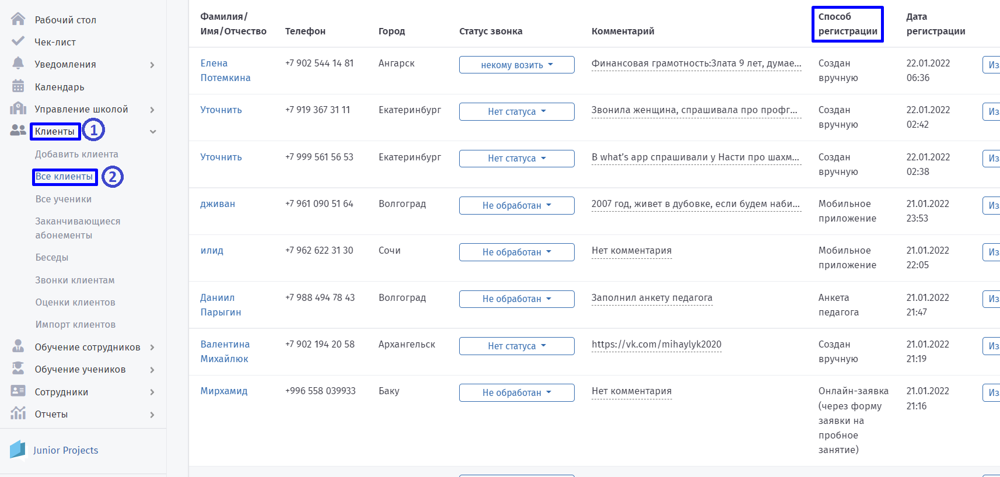
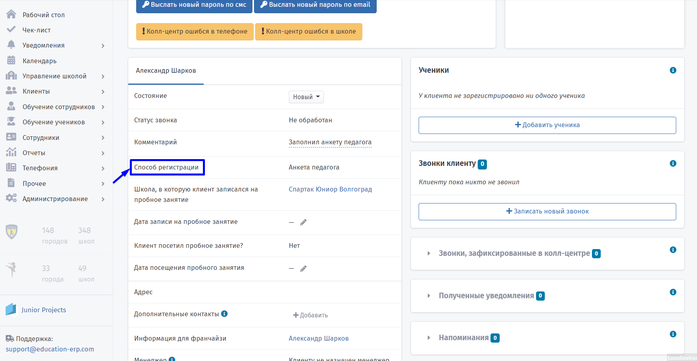

# Источники заявок

**Источники заявок** - инструмент для анализа каналов привлечения клиентов.

Клиенты могут попасть в систему несколькими способами:

**1. Онлайн - заявка.**&#x20;

Способ регистрации клиента через форму заявки на пробное занятие с сайта.

**2. Обмен клиентами.**

Происходит между[ школами-партнёрами.](../nachalo-raboty/shkola/partnyory.md)&#x20;


Посещая одну школу, например, "Юниор", клиент может дополнительно записать ребёнка во вторую, например, "Лига блогеров").

:::

**3. Колл-центр.**&#x20;

Колл-центр - подрядная организация, с которой заключен договор. Заявки появятся в случае, если в вашем типе школ используется колл-центр. Номер колл-центра отображается на лендингах.


Чтобы совершать звонки клиентам из Education ERP, настройте [интеграцию](broken-reference).

:::

**4. Мобильное приложение.**&#x20;

Клиент может скачать мобильное приложение, зарегистрироваться в нём и заявка автоматически отправится в систему.

**5. Внесение заявок вручную.**&#x20;

Клиент может связаться со школой любым другим способом: прийти лично, позвонить на номер телефона менеджеру школы, написать на почту учебного заведения и т.д. В этом случае менеджер школы может вручную занести информацию о клиенте в систему.


**Новые заявки** появятся в разделе [**Уведомления**](../uvedomleniya/) на дашборде и в главном меню.

:::


По способу регистрации клиентов можно отсортировать, используя[ настраиваемый ](nastraivaemyi-spisok-klientov.md)[список.](nastraivaemyi-spisok-klientov.md)

:::

.png>)

:::tip

Чтобы сэкономить время, настройте [интеграцию](../integracii/) - автоматическую передачу заявок между сервисами.

:::

Ознакомьтесь со списком интеграций:

* [Заявки через чат-бот Афина ](../chat-bot-afina/chto-mozhet-afina.md)

Автоматические сообщения чат-бота помогут привлечь новых клиентов в систему и записать их на пробное занятие.

* [Форма сбора заявок Marquiz](../integracii/marquiz/)&#x20;

Форма-опросник Marquiz оставляет контактные данные для связи.

* Форма сбора заявок ВКонтакте или VKontakte

Интеграция используется при таргетированной рекламе или как схема обращений. С помощью ВКонтакте можно собирать заявки с группы. Пользователь видит рекламное объявление с лид-формой в своей ленте новостей.&#x20;

