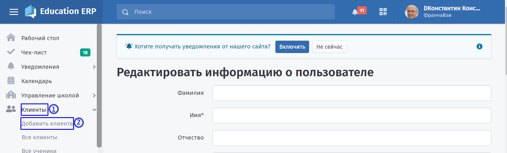
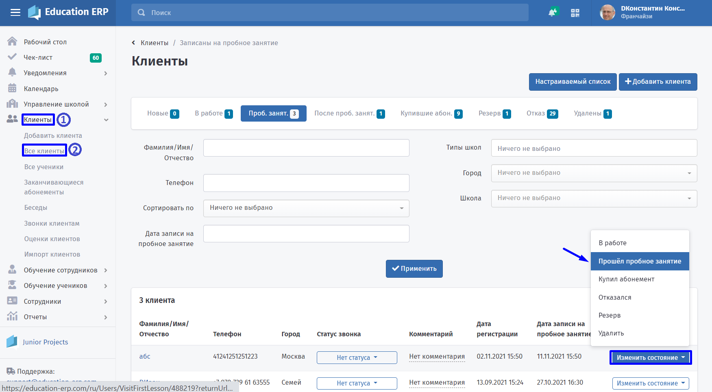
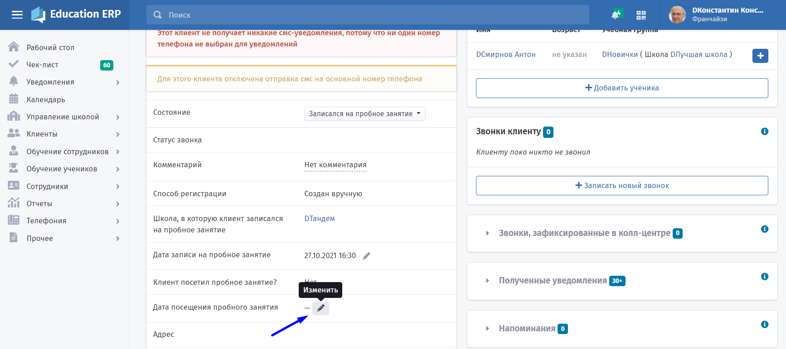
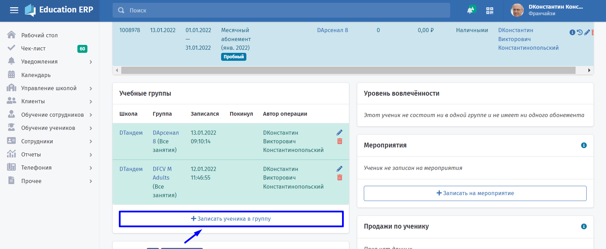
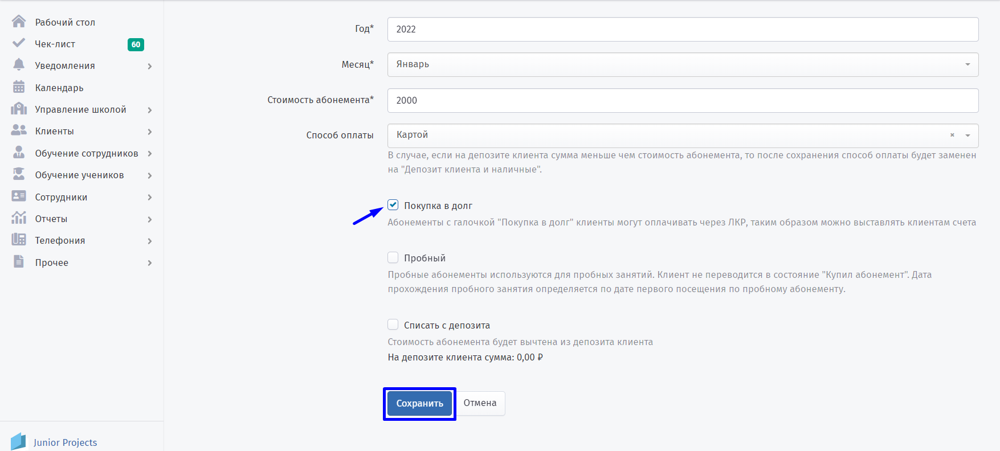

# Как добавить клиента?

**Регистрация клиентов вручную**

Для добавления клиентов вручную перейдите в разделы **Клиенты - Добавить клиента**

:::info 

Заполните информацию о пользователе и нажмите "**Сохранить**".

:::

:::info 

Прикрепите ученика к клиенту.

:::

.png>)

Клиенту может быть выдано **одно** бесплатное пробное занятие. Если у клиента несколько детей, то пробное занятие выдаётся одному из них.

:::info 

Поставьте отметку о пробном занятии в системе.

:::

**Без добавления ученика в группу**

:::info 

На странице клиента в графе **Дата посещения пробного занятия** нажмите карандаш.

:::

:::info 

В появившимся окне выберете школу (если у вас их несколько), группу и дату занятия.

:::

Такая запись удобна тем, что, если у ребенка не возникнет желания в дальнейшем продолжать посещения, то его не нужно будет удалять из группы.

**С добавлением ученика в группу**

:::info 

На странице ученика добавьте его в [группу](./../EducationERP/nachalo-raboty/shkola/gruppa/_index).

:::

Первая отметка о [посещении](./../EducationERP/nachalo-raboty/shkola/pomeshenie) запишется как пробное занятие, а на странице клиента эта дата будет отмечена как дата пробного посещения.

Чтобы дать клиенту доступ в личный кабинет уже на пробном занятии, нужно продать ему [абонемент](./../abonementy/_index). При этом достаточно продать "в долг".

Клиентам, которые регистрируются самостоятельно через сайт или мобильное приложение, доступ к личному кабинету предоставляется сразу же.

:::info 

Если при добавлении абонемента клиенту поставить галочку в пункте "**Пробный**", то доступ в личный кабинет **не будет предоставлен**.

:::