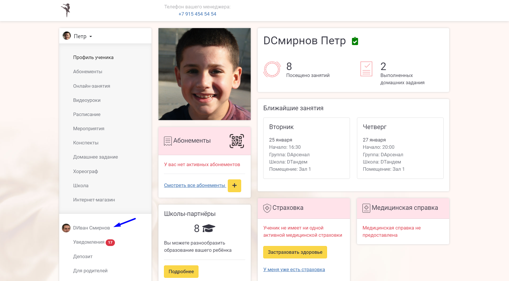
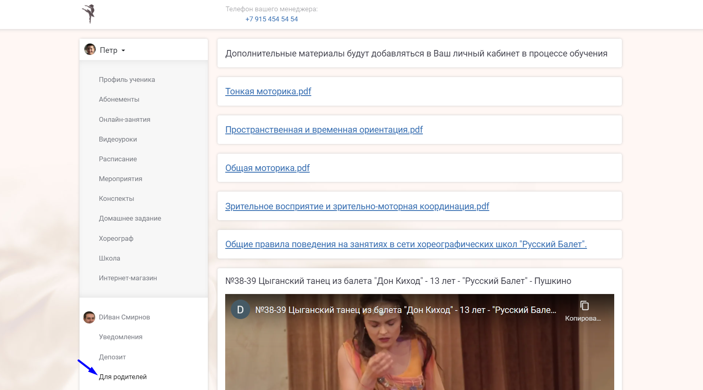
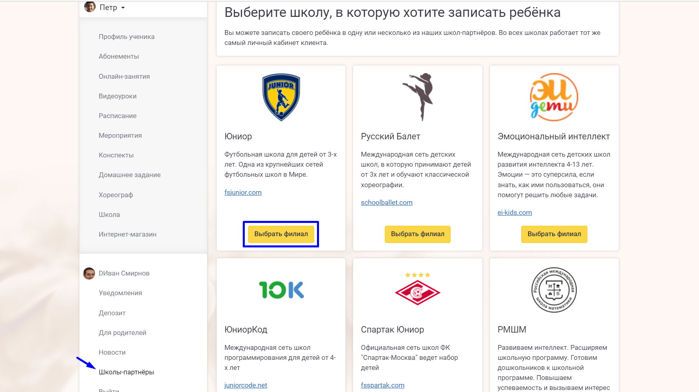

[view:hierarchy=none::::List]

Клиент может в любой момент войти в личный кабинет и купить себе нужный [абонемент](../../abonementy/dobavlenie-abonementov). После установки [ценника](./../../abonementy/cenniki/_index) весь процесс по оформлению абонементов [клиентами ](./../_index)происходит без необходимости участия менеджера школы.

:::info 

Зайдите на профиль клиента, чтобы отредактировать данные, сменить пароль, включить уведомления в браузере.

:::

Клиенты так же, как и [ученики](./../../ucheniki) должны обучаться. Раз в неделю [педагоги](./../../nachalo-raboty/shkola/gruppa/rabota-pedagogov) публикуют образовательные материалы в личный кабинет клиента, где он может с ним ознакомиться.

Система позволяет привязывать одного клиента к нескольким руководителям разных школ. Например, в один день недели ребёнку удобно ходить в одну школу, а в другой день недели – в другую. Также клиент может водить двух разных детей в две разные школы, либо в две разные школы по виду деятельности: к примеру, на футбол и на плавание.

:::info 

Выберете раздел "Школы-партнёры", а затем школу, в которую хотите записать ребёнка.

:::

:::info 

Выберете филиал, в которой хотите записать ученика.

:::

:::info 

При успешной подачи заявки придёт уведомление.

:::

:::info 

Абонемент будет считаться активным, но не оплаченным. Клиенту придёт уведомление о том, что абонемент необходимо [оплатить](./../../abonementy/sposoby-oplaty).

Электронная оплата производится банковской картой. Деньги приходят на следующий рабочий день после платежа на расчётный счёт франчайзи.

:::