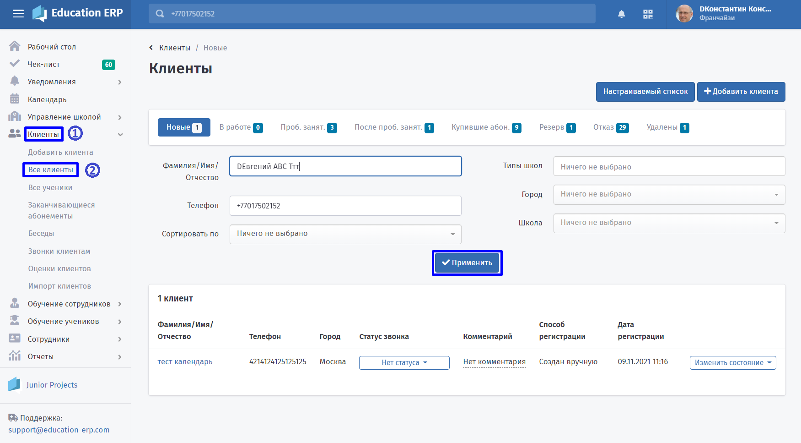
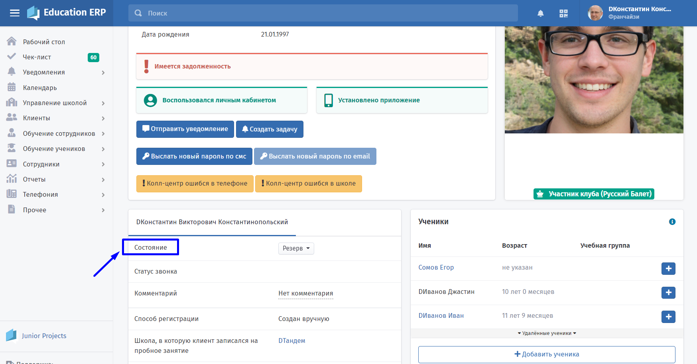
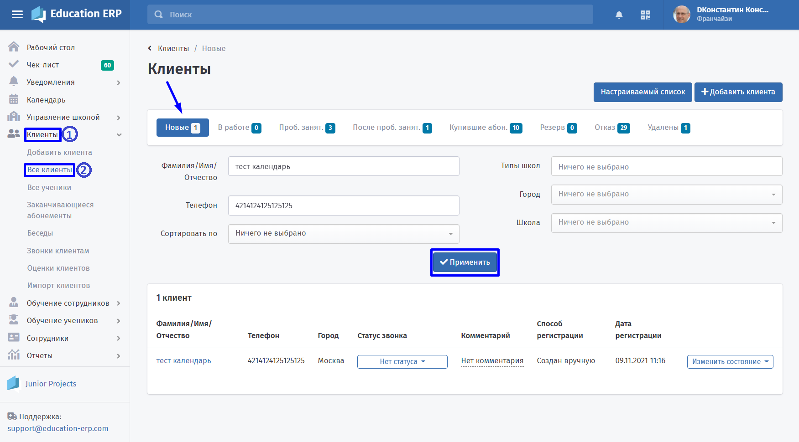
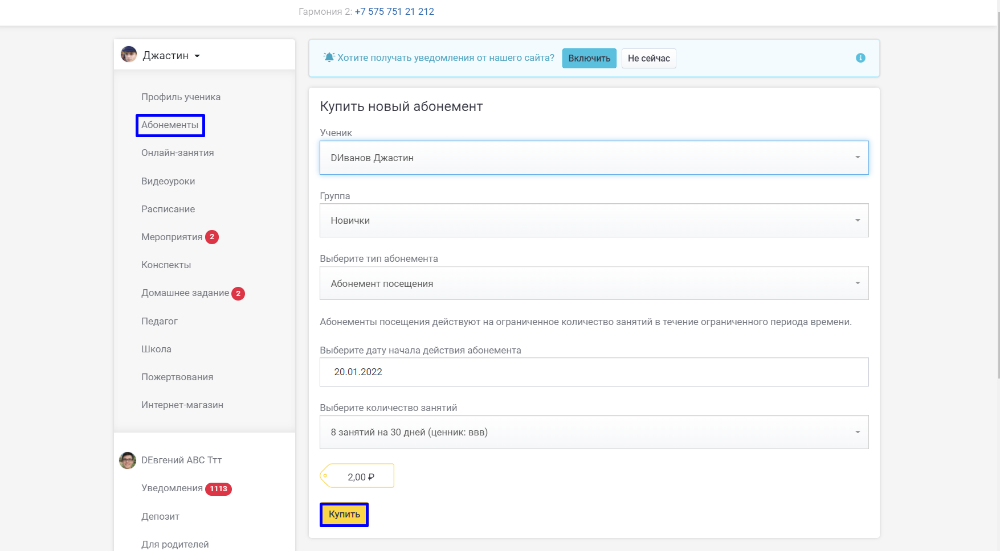
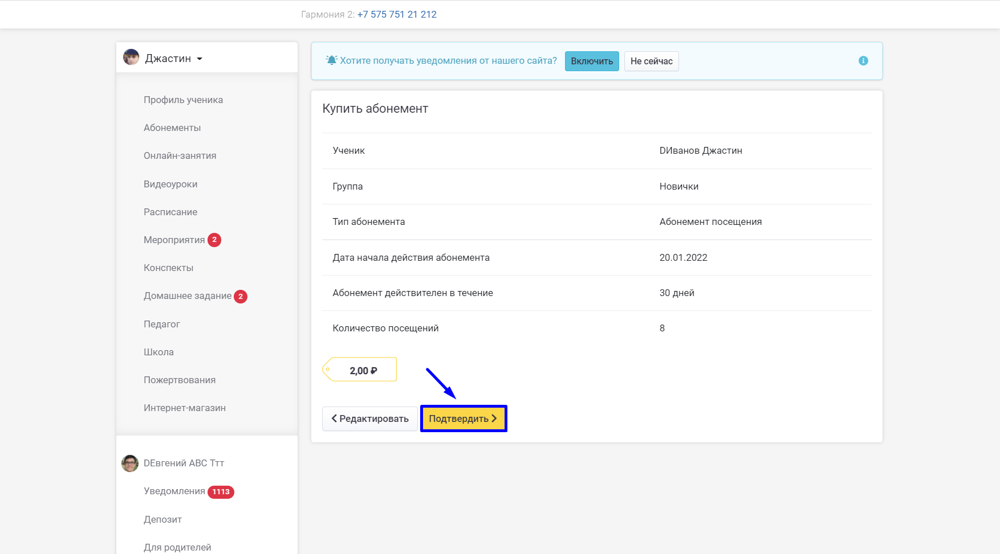
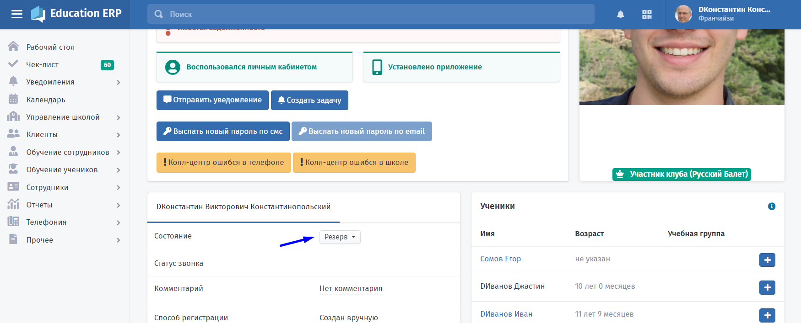
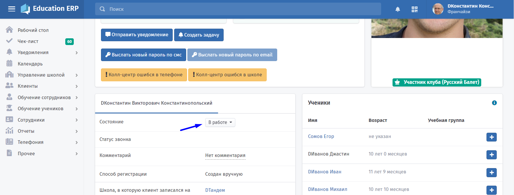
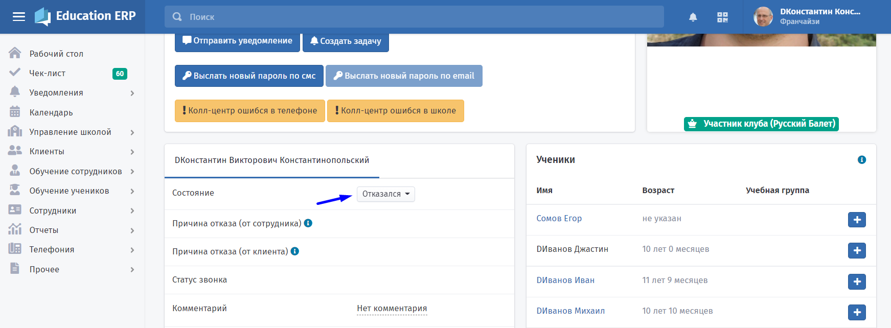
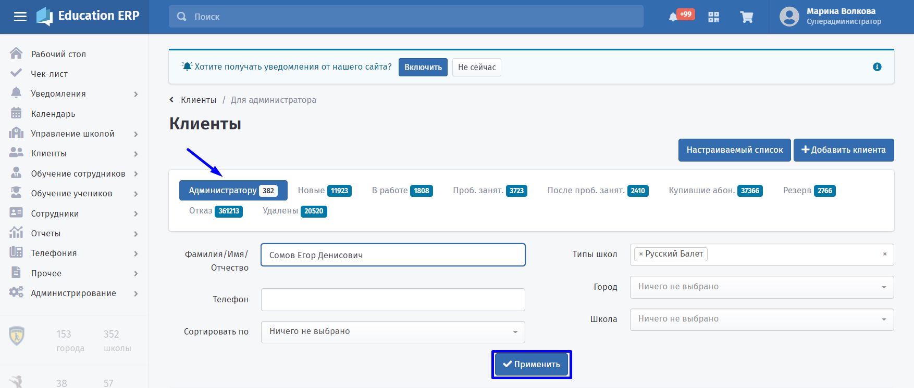

# Состояние клиентов

**Состояние клиента** - заявка, проходящая по различным этапам воронки продаж.

Чтобы посмотреть состояние, зайдите на страницу клиента с разделов **Клиенты - Все клиенты**:

За всё время жизни Клиент проходит следующие этапы:

&#x20; **«Новый»**

В этот список попадают без роли или в роли Клиента, который не посетил пробное занятие и не купили абонемент. Такая заявка ещё не обработана франчайзи, управляющим или фронт-менеджером школы.

**«Купил абонемент»**

Клиент в этом списке приобрёл хотя бы один абонемент, и ученик начал посещать занятия по регулярному расписанию. Это основное состояние для клиентов школы.&#x20;

Абонемент можно [добавить](../abonementy/dobavlenie-abonementov.md) на странице ученика соответствующего клиента или из раздела "Абонементы".&#x20;

 (3).png>)

:::info

Заполните данные ученика и нажмите кнопку **"Купить"**.

:::

:::info

Нажмите кнопку **"Подтвердить"** для оплаты абонемента.

:::

:::info

Заполните данные карты и нажмите кнопку **"Оплатить"**

:::

.png>)

:::info

Вы купили абонемент.

:::

.png>)

:::info

Сотрудники школы должны работать над тем, чтобы клиент как можно дольше оставался в состоянии **"Купил абонемент".**

:::

.png>)

**«Резерв»**&#x20;

Клиент может не согласиться прийти на пробное занятие сразу, но готов посетить его, например, в сентябре. Иногда не хватает мест в группе. В таком случае клиент попадает в список "Резерв".

&#x20; **«В работе»**

Клиент, который не принял решение, не записался на пробное занятие и не отказался, переводится в данное состояние и числится в списке "В работе".

&#x20;**«Отказался»**&#x20;

Клиент может отказаться посещать занятия на любом этапе общения с сотрудниками школы. Он может отказаться после года посещений занятий или ещё до посещения пробного занятия. Клиент автоматически переводится в состояние отказался, если прошло больше 5-ти месяцев после последней покупки абонемента или последней отметки о посещении ученика. Ученик будет откреплен от группы, в случае, если клиент попал в состояние отказался.

&#x20;**«Удалён»**&#x20;

Информация о клиентах никогда не удаляется из системы. По всем клиентам школы ведётся история и собирается общая статистика.&#x20;

:::info

Удаляют только ошибочно созданных клиентов. Если клиент действительно посещал занятия или хотя бы осознанно оставил заявку на пробное занятие, но больше не собирается приходить, его переводят в состояние Отказался, а не в Удалён.&#x20;

:::

Однако иногда бывают заявки от людей, которые и не могли стать клиентами. Например, это может быть спам, дубликаты, заявки от детей, ошибочные заявки. Для таких случаев предусмотрено специальное состояние «Удалён», чтобы такие заявки нигде больше не фигурировали.

:::info

Все ученики клиента будут удалены из групп, в которые они ходят.

:::

**«Для администратора»**

В данное состояние попадает клиент, оставивший заявку через клиентский сайт в городе, где еще нет школы. Такой клиент не прикреплён ни к одному франчайзи и не имеет детей.&#x20;

&#x20;**«Прошел пробное занятие»**

&#x20;В этом состоянии клиент уже посетил пробное занятие, но пока не принял решение о покупке абонемента.

**«Записался на пробное занятие»** Менеджер школы уже связался с клиентом, выяснил детали и назначил конкретную дату для пробного занятия.&#x20;

:::info

Если у клиента несколько учеников, то право на бесплатное занятие имеет только один ученик.

:::

&#x20;

&#x20;

&#x20;&#x20;

