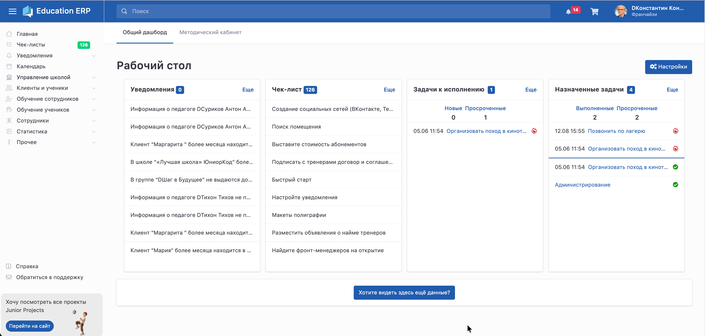
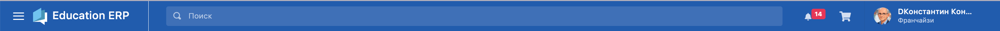

После входа в Education ERP открывается **Главная** -- рабочий стол пользователя. Отсюда можно перейти к основным разделам системы, увидеть актуальные уведомления, задачи и другую информацию.

{width=2910px height=1388px}

## **1\. Верхняя панель**

{width=2906px height=92px}

На верхней панели расположены:

-  **☰ Меню** -- позволяет свернуть или развернуть боковую панель.

-  **Поиск** -- поиск информации в системе.

-  **🔔 Уведомления** -- быстрый доступ к новым уведомлениям.

-  **Корзина** -- переход к покупкам/заказам.

-  **Профиль пользователя** -- имя пользователя и его текущая роль.

## **2\. Главное меню**

Слева находится основная навигация Education ERP.

**Главная** -- рабочий стол и основные виджеты.

**Чек-листы** -- задачи и действия по чек-листам.

**Уведомления** -- напоминания и рассылки. Из этого раздела можно, например, создать напоминание себе, сделать рассылку клиентам, ученикам или сотрудникам и посмотреть статистику отправленных уведомлений.

**Календарь** -- работа с календарём и событиями.

**Управление школой** -- школы, группы и другие инструменты управления.

**Клиенты и ученики** -- работа с клиентской базой и учениками. Например, список всех учеников открывается именно через **Клиенты и ученики -> Все ученики**.

**Обучение сотрудников** -- материалы и инструменты обучения сотрудников.

**Обучение учеников** -- домашние задания, материалы и другие инструменты обучения.

**Сотрудники** -- работа с сотрудниками. Добавление нового сотрудника сейчас выполняется через **Сотрудники -> Добавить сотрудника**.

**Статистика** -- отчёты и показатели работы.

**Прочее** -- дополнительные возможности системы.

В нижней части меню находятся **Справка** и **Обратиться в поддержку**.

:::quote 

💡 Пункты со стрелкой можно раскрыть, чтобы перейти к подразделам.

:::

## **3\. Главная и рабочий стол**

После входа пользователь попадает на **Главную**.

В верхней части доступны вкладки:

**Общий дашборд**

**Методический кабинет**

На общем дашборде информация отображается в виде отдельных виджетов.

На твоём скриншоте сейчас выведены:

-  **Уведомления**

-  **Чек-лист**

-  **Задачи к исполнению**

-  **Назначенные задачи**

При этом состав рабочего стола пользователь может менять.

## **4\. Настройка рабочего стола**