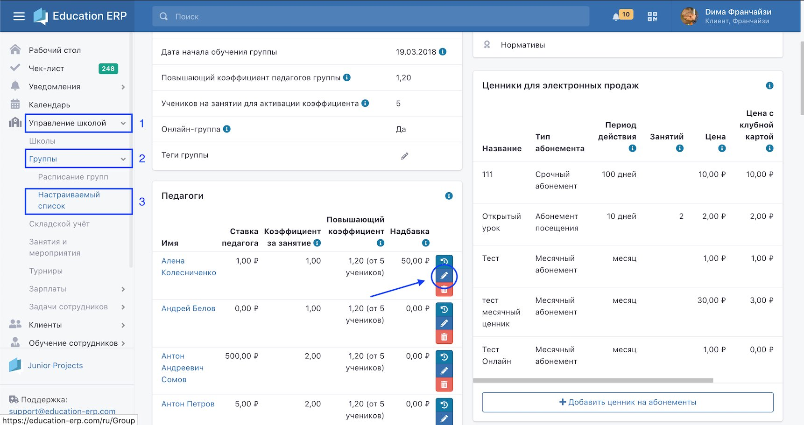
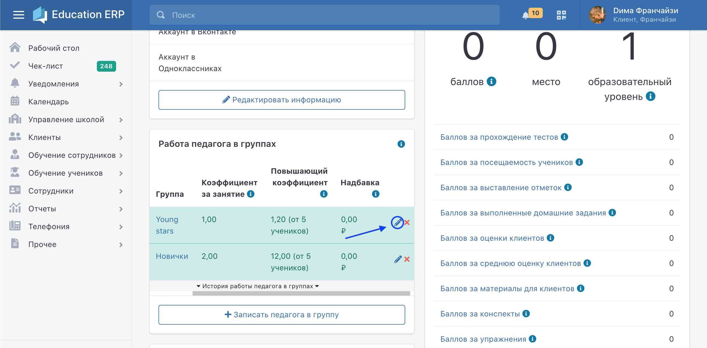
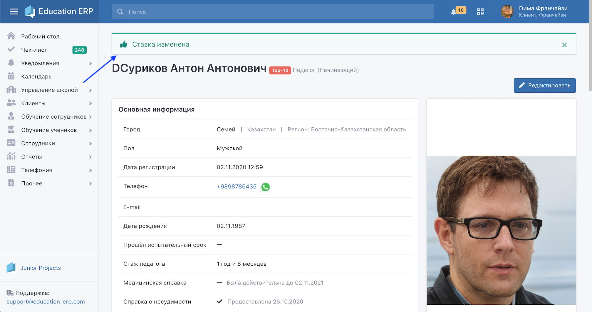

# Работа педагогов

**Основные возможности:**

1\. Отметка [посещений учеников](poseshaemost-uchenikov.md), если это разрешено настройками на странице школы;

2\. Составление конспектов, конспекты отображаются в личном кабинете клиента;

3\. Составление и выдача домашних заданий, доступных в личном кабинете клиента;

4\. Составление плана мероприятий;

5\. Приём и выставление нормативов, если актуально для типа школ;

6\. Планирование и проведение бесед с клиентами и внесение данных об этом в систему;

7\. Добавление материалов для клиентов (родителей), предварительно материалы должны быть выложены администратором в каталог “Для клиентов через   педагогов“;

8\. Прохождение тестов для самообразование;

9\. Участие в рейтинге тренеров своей сети школ.

Для того, чтобы изменить ставку преподавателю, перейдите по вкладкам: **Управление школой - Группы - Настраиваемый список.** Далее выберите интересующую вас **группу** и **педагога**. Для редактирования вы можете нажать на карандаш

или пройдите в профиль педагога нажав в этом же разделе на **имя** или воспользуйтесь **поиском**, после чего в блоке **Работа педагога в группах** напротив необходимой группы нажмите на карандаш, чтобы изменить ставку.

### **Ставка**

**Ставка** влияет на зарплату педагога. В зависимости от роли, в которой педагог выступал на занятии, ему может быть начислена разная зарплата. Один и тот же сотрудник может быть помощником педагога на занятиях в одной группе и старшим педагогом в другой группе, зарплата за каждую должность рассчитывается в зависимости от ставки за должность.

Cтавки, которые отмечены галочками, будут отображаться в выпадающем списке в расписании группы при проставлении отметок сотрудникам, которые провели занятие в группе, даже если сумма по ставке равна нулю.

### Повышающий коэффициент

На группу можно установить **повышающий коэффициент**, стимулирующий педагогов к повышению посещаемости в группе. В этом случае при превышении на занятии заданного количества учеников педагогу начисляется зарплата, умноженная на указанный коэффициент.&#x20;

### Надбавка

Дополнительно для сотрудников можно установить **фиксированную надбавку** **за** каждого ученика, **посетившего занятие**.

По завершении редактирования повторно проверьте корректность внесенной информации и нажмите **Сохранить**.

#### Отметка о работе педагога/фронт-менеджера

Также менеджер школы на каждом занятии отмечает, какие педагоги провели это занятие. Отметки влияют на зарплату педагога и на заработанные баллы. Один и тот же педагог на разных занятиях может играть разные роли: на одном занятии он может выступать старшим педагогом, на другом – помощником педагога.&#x20;


