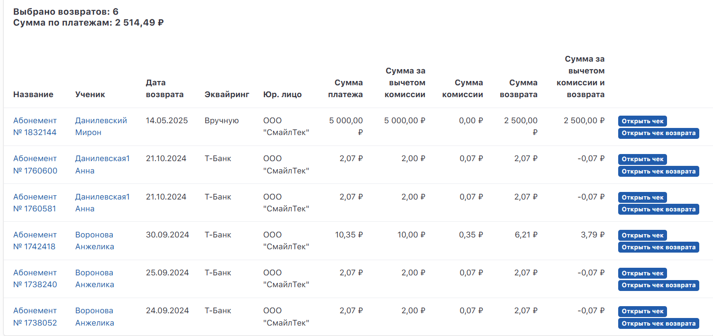

В системе Education ERP в разделе **Статистика -> Платежи** появилась отдельная вкладка **«Возвраты»**.\
Она предназначена для удобного контроля всех операций, связанных с возвратом денежных средств клиентам.

## Фильтры во вкладке «Возвраты»

Чтобы быстро найти нужные данные, доступны следующие фильтры:

-  **Наличные / Онлайн** -- выбор способа оплаты, по которому был оформлен возврат.

-  **Юридическое лицо** -- можно отфильтровать возвраты по конкретному юр. лицу.

-  **Тип платежа** -- позволяет выделить возвраты по определённым видам платежей (например, абонементы, мероприятия и др.).

-  **Дата возврата** -- поиск возвратов за конкретный день, неделю или любой период.

-  **Сумма возврата** -- фильтрация возвратов по указанной сумме.

-  **Школы** -- позволяет просмотреть возвраты по отдельной школе или по всем школам сразу.

## Информация в таблице возвратов

На странице отображается детализированная таблица с данными по каждому возврату.

{width=1504px height=709px}

-  **Название** -- наименование платежа (например, абонемент или занятие).

-  **Ученик** -- ученик, за которого был оформлен возврат.

-  **Дата возврата** -- когда был проведён возврат средств.

-  **Эквайринг** -- платёжная система, через которую проводилась операция.

-  **Юр. лицо** -- юридическое лицо, оформившее возврат.

-  **Сумма платежа** -- первоначальная сумма оплаты.

-  **Сумма за вычетом комиссии** -- сумма, поступившая после удержания комиссии эквайринга.

-  **Сумма комиссии** -- размер комиссии, удержанной при оплате.

-  **Сумма возврата** -- сумма, возвращённая клиенту.

-  **Сумма за вычетом комиссии и возврата** -- итоговый расчёт после всех операций (оплаты, комиссий, возвратов).

   

   :::tip 

   1. Контроль всех возвратов в разрезе школ и юр. лиц.

   2. Быстрая проверка, какие суммы были возвращены.

   3. Анализ общей финансовой картины: сколько средств поступило, сколько удержано комиссией и сколько возвращено клиентам.

   4. Прозрачная отчётность по возвратам для бухгалтерии и руководителей.

   :::

