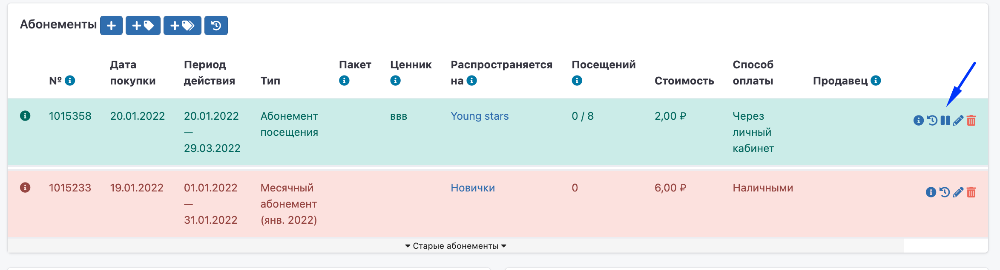
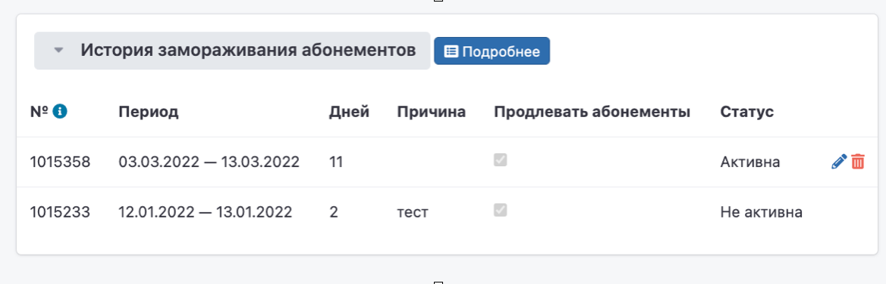
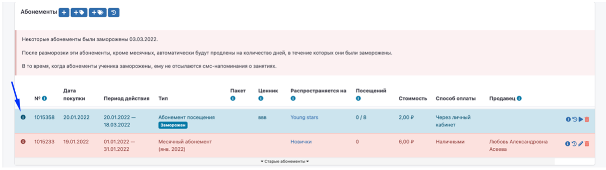

# Заморозка для каждого абонемента

В системе Education ERP реализован новый механизм заморозки абонементов.

\
Каждый из действующих абонементов можно заморозить отдельно от остальных абонементов ученика.

Ранее замораживались сразу все абонементы ученика.

\
Для заморозки абонемента необходимо нажать на кнопку Заморозки/Разморозки справа в блоке «Абонементы».

Установите даты заморозки, укажите причину и отметьте галочку «Уважительная причина», если хотите, чтобы абонемент ученика   продлился на период действия заморозки.&#x20;


Абонемент продлится не сразу, а когда закончится заморозка.


**Общая кнопка заморозки всех абонементов ученика временно скрыта.**

В блоке «История замораживания абонементов» на странице ученика для каждого абонемента добавлена запись о заморозке. Запись можно отредактировать/удалить.


Если заморозка закончилась, то удалить или отредактировать её будет невозможно. Если такая необходимость появится, напишите, пожалуйста, нам на [support@education-erp.com](mailto:support@education-erp.com).


\
Заморозка действует на период с даты начала (включительно) и по дату окончания (включительно). Т.е., если указан срок с 3.03.2022 - 06.03.2022, то абонемент будет заморожен с 3-го марта по 6-е марта включительно и будет разморожен 7-го марта.\


При заморозке месячных абонементов не будет возможности отметить галочку «Уважительная причина». Месячные абонементы выдаются на 1 календарный месяц и не могут быть продлены. Если вы все-таки заморозили месячный абонемент, то сможете вручную назначить ученику абонемент-компенсацию.&#x20;


Замороженные абонементы в системе синего цвета с отметкой «Заморожен».&#x20;

