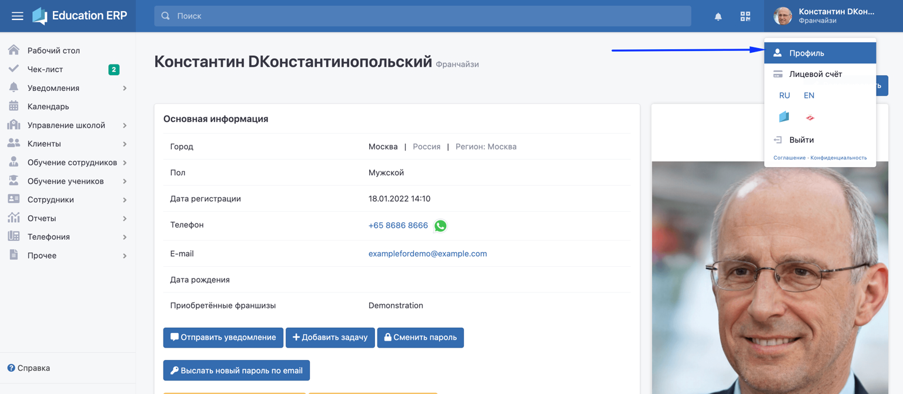
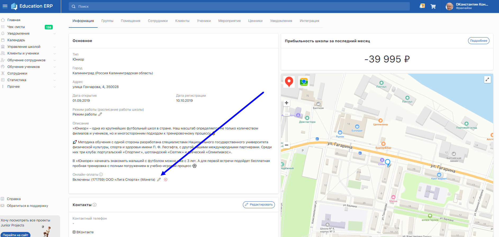

[view:hierarchy=none::::List]

:::info 

Education ERP теперь подключён напрямую к сервису интернет-эквайринга от [Т-Банка](https://www.tbank.ru/)

Комиссия за платёж составит 3.35%.

:::

Франчайзи может организовать онлайн-оплату в своей школе. Для этого ему потребуется подключить эквайринг:

1. Перейдите на страницу своего профиля (отправить заявку на подключение онлайн-оплаты доступно только франчайзи), кликнув на своё имя в правом верхнем углу. 

   {width=1536px height=672px}

2. В нижней части страницы  нажать на кнопку «Добавить юридическое лицо».

   {width=1890px height=870px}

3. Заполнить данные своего юридического лица. Также необходимо указать реквизиты расчётного счета, на который будет поступать оплата.

4. Перейти на страницу школы -> вкладка «Информация» -> нажать на карандаш в поле «Онлайн-оплаты» и выбрать юр. лицо (С припиской "Т-Банк").

   {width=1886px height=897px}

В течении нескольких минут будут подключены онлайн-оплаты и клиенты смогут приобрести абонементы через личный кабинет, если вы назначите ученикам абонементы с пометкой "[В долг](../nachalo-raboty/shkola/abonementy/dobavlenie-abonementov/abonementy-v-dolg)" или покажите [ценники для электронных продаж в ЛК клиента](./../abonementy/cenniki/_index).

:::info 

Обратите внимание, что при осуществлении платежей T-Банк устанавливает комиссию 3,35% от суммы платежа.\
Настройка "**Переложить комиссию на клиентов**" - при оплате через кабинет клиента цена абонемента будет автоматически увеличена на размер комиссии, клиент будет об этом предупреждён.

---

Дополнительного договора на использование эквайринга подписывать не потребуется, организация онлайн-платежей будет в рамках вашего действующего договора с ООО "Лига спорта".

:::

## Интерфейс оплаты абонемента для клиента

## Чек для клиента

Все чеки выпускаются сразу через централизованную кассу Лиги Спорта.

Франчайзи больше не требуется приобретать отдельные онлайн-кассы на каждый филиал.

В чеке будет указана Лига Спорта как агент и юридическое лицо франчайзи как поставщик.

\\

.png "Пример чека, получаемого клиентом")

Просмотр чека доступен для каждого абонемента, купленного через эквайринг Т-Банка. Для этого в блок "Абонемент" добавлена кнопка "Открыть чек".

## Использование электронных платежей

Покупка абонементов - из [ценников](./../abonementy/cenniki/_index).

Оплата назначенных [ученику](../ucheniki) [абонементов](https://app.gitbook.com/s/-MkFNHt9T_SX73MEMmIU/c/cgKOyxkqHa8Qxc8VSvAr/nachalo-raboty/shkola/abonementy/dobavlenie-abonementov/abonementy-v-dolg).

Приобретение билетов на [мероприятия](https://app.gitbook.com/s/-MkFNHt9T_SX73MEMmIU/c/cgKOyxkqHa8Qxc8VSvAr/nachalo-raboty/shkola/meropriyatiya).

