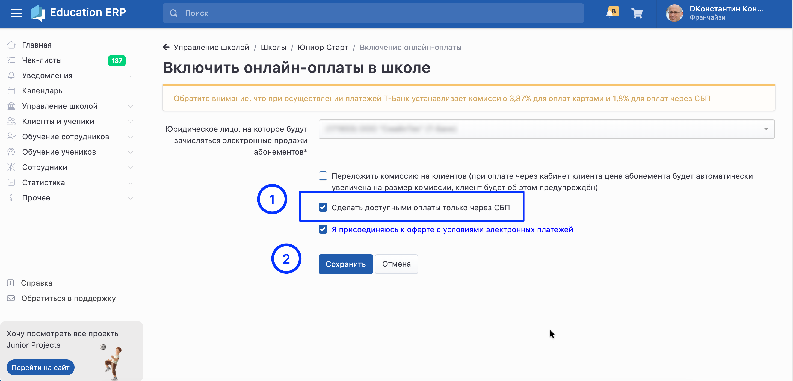

При необходимости можно оставить клиентам только оплату через СБП.\
Это может быть удобно, например, когда школа хочет исключить оплату картой и использовать только СБП.

## **Как включить**

1. Перейдите на страницу **Школы**.

2. Откройте раздел **Онлайн-оплаты**.

3. Нажмите **Редактировать**.

4. Установите галочку **«Сделать доступными оплаты только через СБП»**.

5. Нажмите **Сохранить**.

{width=2904px height=1395px}

:::info 

В личном кабинете клиента при покупке абонемента будет доступна только кнопка **«Оплатить по СБП»**.

Оплата картой отображаться не будет.

:::