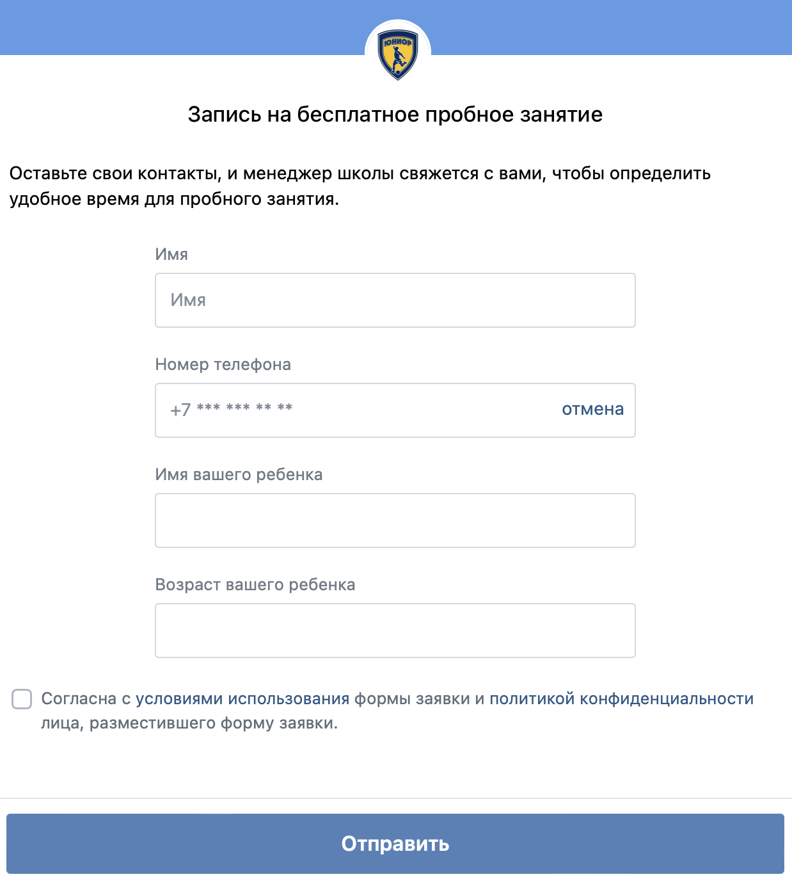

# Подключение онлайн-платежей

На странице Франчайзи необходимо "Отравить заявку на подключение электронных платежей".

.png>)

<figure><figcaption></figcaption></figure>

Далее:

* Заполните информацию в заявке.
* Скачайте, заполните и отправьте документы по обычной почте.
* По указанному телефону менеджера уточните, кто конкретно будет менеджером в вашем регионе и куда следует направить документы по электронной и бумажной почте.


**Обязательно **<mark style="color:red;">**самостоятельно**</mark>**  свяжитесь с менеджером Сбербанка по указанному номеру телефона и уточните, куда выслать оригиналы документов и на какой адрес электронной почты отправить сканкопии .**

Для каждого региона будет свой  менеджер и важно, чтобы документы попали именно к нему, иначе ответа по заявке не будет. Но уточнить, кто будет именно вашим менеджером, возможно только по телефону  [+7 983 053 0359](tel:+79830530359), указв ИНН  юр лица для которого регистрируется эквайринг.


После подключения эквайринга франчайзи получит информацию о настройках для перевода в боевой режим =включение онлайн оплаты (ранее такая информация поступала в службу технической поддержки и далее настройка проводилась сотрудником ТП, сейчас в Сбербанке произошли изменения и каждый франчайзи будет проводить настройку самостоятельно) .

### **Перевод в боевой режим**

После поступления информации о переводе в боевой режим, необходимо сделать следующее:

1.  Скопировать из заявки логин и пароль для авторизации в личном кабинете. Пример:Для авторизации в [личном кабинете](https://securepayments.sberbank.ru/mportal3) используйте следующие данные:

    логин/пароль: fsjunior\_3-operator / Password\*1
2. Открыть страницу по данной ссылке [  https://securepayments.sberbank.ru/mportal3/login](https://securepayments.sberbank.ru/mportal3/login);
3. Ввести логин и пароль, полученные на этапе 1;
4. Будет предложено ввести новый пароль, придумайте новый пароль и обязательно его запомните (скопируйте и сохраните на компьютере, например, в заметках);

Далее следует зайти в пункт меню настройки -> основные -> вкладка callback -> уведомления

* В пункте "Продавец" выбрать fsjunior.com или добавить свой новый адрес
* Нажать галочку Включить callback-уведомления
* В пункте Ссылки добавить ссылку [https://education-erp.com/salesubscription/sberbankcallback](https://education-erp.com/salesubscription/sberbankcallback)
* HTTP-метод GET
* Тип callback-а Статический
* Тип подписи - Симметричный

<figure><figcaption></figcaption></figure>

7. Далее откройте свой профиль в ERP и нажмите название Юр лица, для которого заполняете информацию, в блоке "Юридические лица для электронных продаж";

Название юридического лица будет заполнено автоматически.

В поле "Логин" заполните  данные из пункта 1.

В поле "Пароль" заполните  данные из пункта 4.

В поле "Токен продавца" заполните  данные из  поля "Открытый ключ" из личного кабинета Сбербанка.

В поле "Секретный ключ"   заполните  данные из  поля " Callback токен" из личного кабинета Сбербанка.

&#x20;Нажимаем "Сохранить".

<figure><figcaption></figcaption></figure>

8. Настройка завершена. На странице школы необходимо выбрать это юридическое лицо.\
   В торговой точке для модуль.кассы (если она используется в школе) проверьте, что также выбрано необходимое юридическое лицо. &#x20;


Дополнительную кассу, рекомендуемую в Сбербанке, приобретать не стоит. В Education ERP возможна интеграция только с модуль.кассой.


**Для возможности использования эквайринга в интернет-магазине необходимо подключиться по api:**

1. необходимо заполнить последние два поля нас транице юридического лица.\
   Эти жанные необходимо запросить в технической поддержке сбербанка через личный кабинет.&#x20;

<figure><figcaption></figcaption></figure>

2. После заполнения данных необходимо включить настройки в Education ERP.&#x20;

**Для настройки электронных платежей перейдите в раздел Инвентарь - Настройки - Электронные платежи и выберите нужное юр. лицо.**
