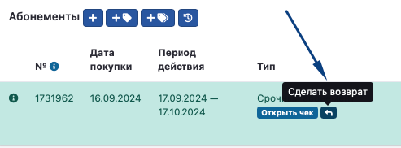
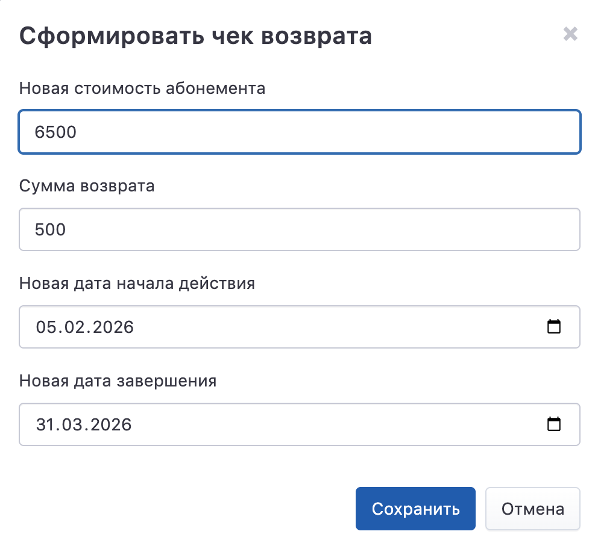

На странице ученика для каждого абонемента, купленного через эквайринг Т-Банка, добавлена кнопка «Сделать возврат».

{width=493px height=182px}

Откроется страница, на которой надо ввести сумму, сколько рублей необходимо вернуть. По умолчанию указывается полная стоимость абонемента. Сумма не должна быть меньше нуля и больше стоимости абонемента.

{width=768px height=284px}

:::info 

Возвраты производятся за счёт будущих перечислений франчайзи. Если денег от перечислений не хватает для возвратов в течение 20 дней, то франчайзи проинформируют об этом, и деньги будут списаны с лицевого счёта в Educattion ERP.

:::