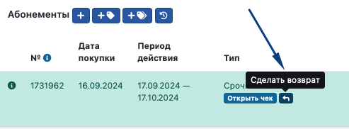

На странице ученика для каждого абонемента, купленного через эквайринг Т-Банка, добавлена кнопка «Сделать возврат».

{width=493px height=182px}

Откроется страница, на которой надо ввести сумму, сколько рублей необходимо вернуть. По умолчанию указывается полная стоимость абонемента. Сумма не должна быть меньше нуля и больше стоимости абонемента.

[image:./vozvrat-klientu-posle-onlain-oplaty-2.png:::0,0,100,100:55::987px:907px:center]

:::info 

Для использования возвратов на лицевом счёте должны быть средства, равные или больше суммы возврата. Это ваш гарантийный депозит.

При оформлении возврата система проверяет баланс лицевого счёта и предупреждает, если средств недостаточно.

:::

:::danger 

Если сумма на вашем расчетном счете больше суммы возвратов -- на р/с поступит сумма за вычетом возвратов.\
Если сумма на вашем расчетном счете меньше суммы возвратов -- недостача спишется с лицевого счёта в Education ERP.

:::