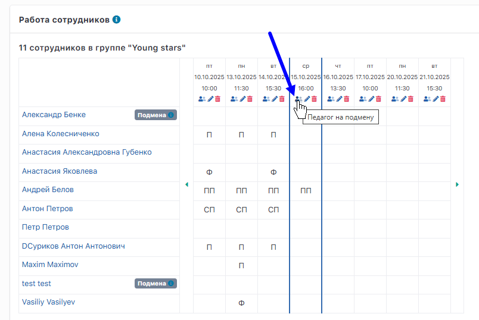
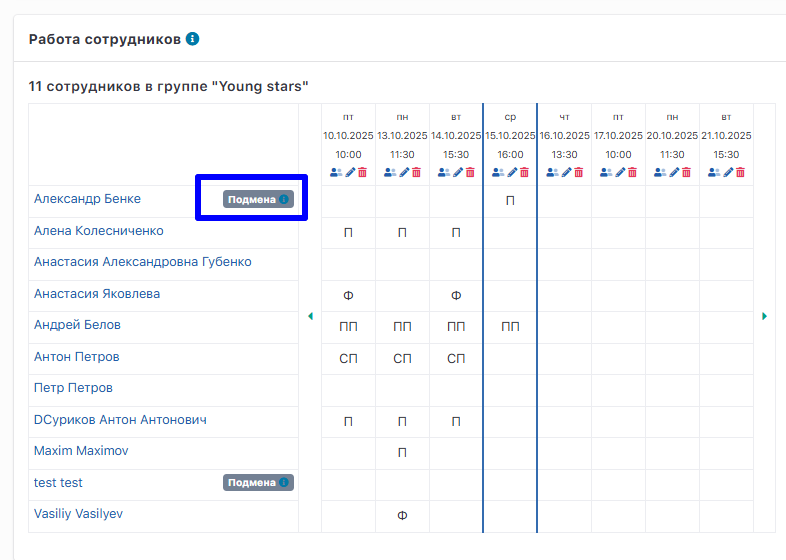

Если занятие провёл сотрудник, который **не прикреплён к текущей группе**, в системе можно отметить это с помощью функции **«Педагог на подмену»**.

Функция доступна на странице группы, в блоке **Работа сотрудников**, в ячейке с датой занятия.

{width=804px height=538px}

## Как добавить педагога на подмену

1. Перейдите на страницу нужной группы.

2. В блоке **Работа сотрудников** нажмите на ячейку с датой занятия.

3. Выберите **«Педагог на подмену»**.

4. В открывшемся окне заполните:

   -  **Сотрудника** -- выберите из выпадающего списка.

   -  **Роль сотрудника на занятии** (педагог, помощник педагога, старший педагог, фронт-менеджер).

   -  **Фиксированную оплату за занятие** -- указывается вручную (коэффициенты не применяются).

5. Проверьте корректность данных и нажмите **«Подтвердить и отправить»**.\
   ⚠️ После сохранения изменить данные будет нельзя.

В таблице **Работа сотрудников** педагог на подмене отображается с пометкой **«Подмена»**.

{width=786px height=560px}

На подмену можно назначить педагога не прикреплённого к группе в текущий момент.

:::lab 

Сотрудники с меткой **«Подмена»**  -- это сотрудники, которые:

-  не прикреплены к группе в данный момент, но вели занятия в ней в течение последних двух недель,

-  были откреплены от группы за последние две недели.

:::

