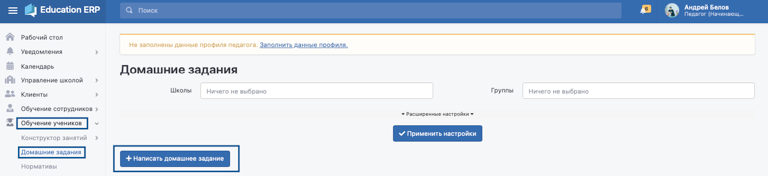
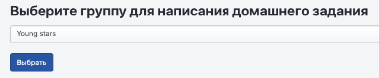
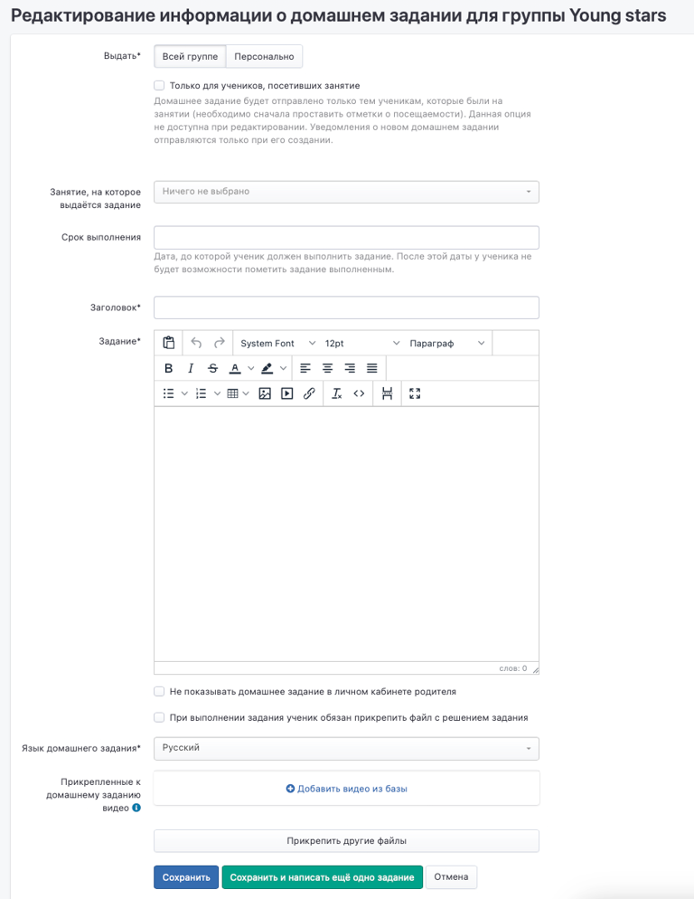

Для того, чтобы выдать домашнее задание, необходимо зайти в меню Обучение учеников -> Домашние задания -> Написать домашнее задание.

{width=768px height=176px}

Выбрать группу для написания домашнего задания.

{width=639px height=132px}

Откроется страница редактирования информации о домашнем задании для группы. Здесь можно указать, выдаётся задание всей группе или же кому-то из учеников персонально (для каждого может быть своё домашнее задание), а также можно выдать домашнее задание только тем, что был на занятии.

{width=768px height=994px}

После внесения всей информации по домашнему заданию надо нажать «Сохранить» или «Сохранить и написать ещё одно задание» (в случае, если например, будете выдавать каждому ученику персональное домашнее задание).

Сохранённое домашнее задание можно отредактировать либо сразу после сохранения, либо потом через меню Обучение учеников -> Домашние задания -> списке выбрать то, которое надо изменить.

{width=768px height=221px}

В личном кабинете клиента домашнее задание отобразится в блоке «Домашние задания» с возможностью выполнить его.

{width=768px height=484px}