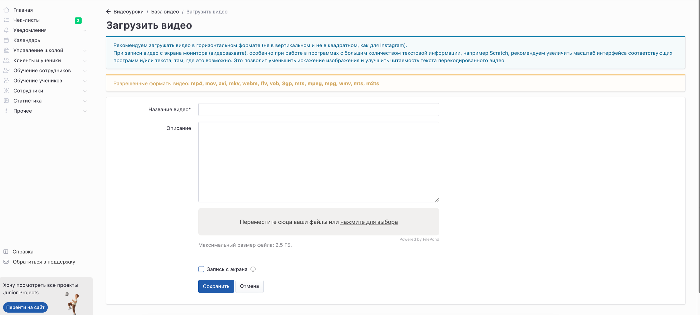
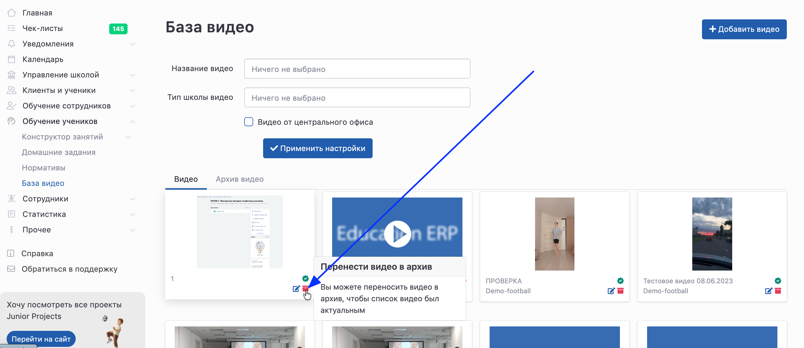

В системе **Education ERP** предусмотрена **база видео**, которая используется для хранения обучающих материалов и последующего использования в домашних заданиях для учеников.

Видео из базы можно прикреплять к домашним заданиям, что позволяет выстраивать системное обучение и повышать вовлечённость учеников.

## Где находится база видео

Перейти в раздел можно через главное меню:

**Обучение учеников -> База видео**

---

## Добавление видео

Чтобы загрузить новое видео в систему:

1. Перейдите в раздел **База видео**

2. Нажмите кнопку **Добавить видео**

3. Заполните необходимые поля

4. Загрузите файл

5. Нажмите **Сохранить**

{width=2884px height=1298px}

---

## Параметры видео

При добавлении видео необходимо указать:

### Название видео \*

Обязательное поле.\
Название должно быть понятным и отражать содержание видео.

---

### Описание

Дополнительное поле.\
Можно указать:

-  тему занятия;

-  рекомендации для выполнения задания;

-  пояснения для учеников или родителей.

---

### Файл видео

Загрузите видеофайл с компьютера.

---

## Требования к видео

### Формат видео

Поддерживаются следующие форматы:

mp4, mov, avi, mkv, webm, flv, vob, 3gp, mts, mpeg, mpg, wmv, m2ts

---

### Размер файла

Максимальный размер файла:\
**до 2,5 ГБ**

---

:::tip 

Чтобы видео корректно отображалось и было удобно для просмотра, рекомендуется использовать **горизонтальный формат (16:9)**

:::

---

## Редактирование и управление видео

После загрузки видео можно:

-  редактировать название и описание;

-  использовать в разных домашних заданиях;

-  повторно применять для разных групп.

Если видео больше не используется, его можно **перенести в архив** -- в этом случае оно не будет отображаться в основном списке, но при необходимости его можно будет вернуть и использовать снова.

:::tip 

Рекомендуется архивировать устаревшие или неактуальные материалы, чтобы поддерживать порядок в базе видео.

:::

{width=2900px height=1258px}