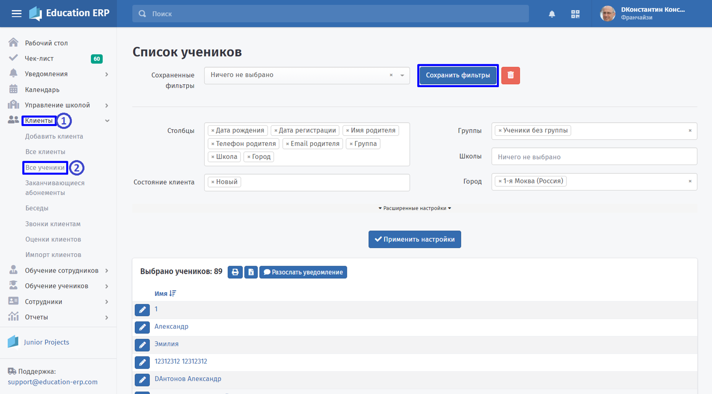
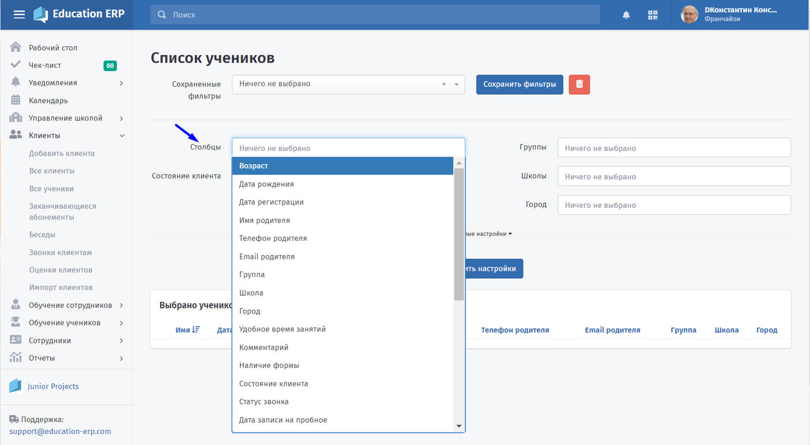
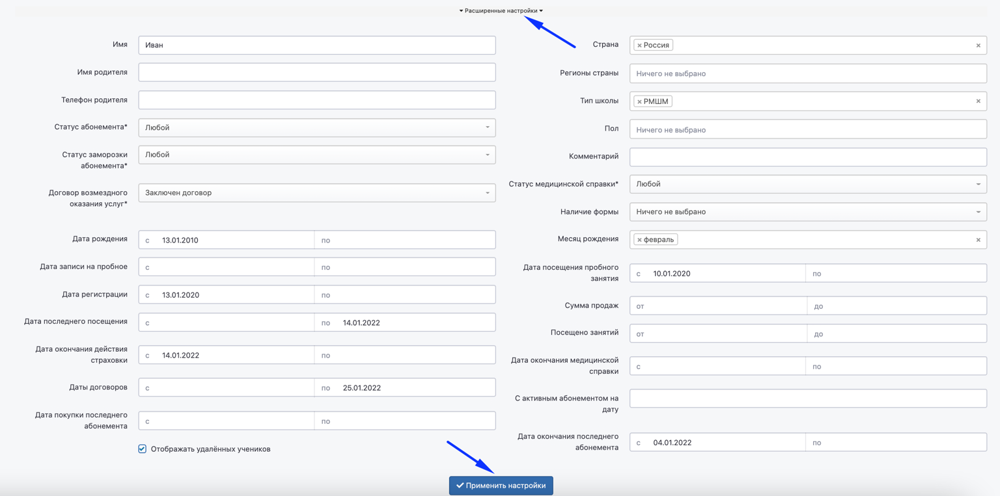
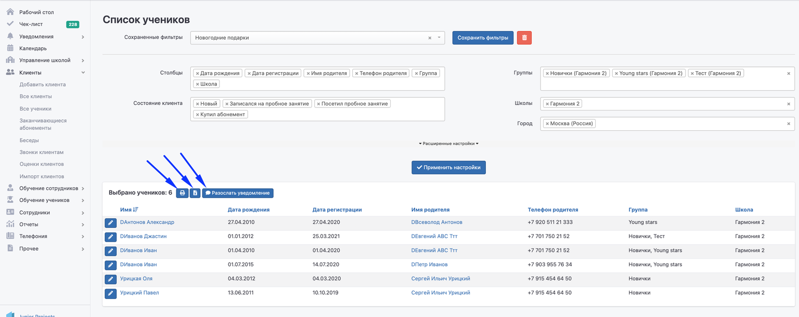
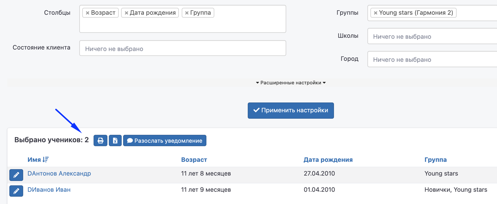
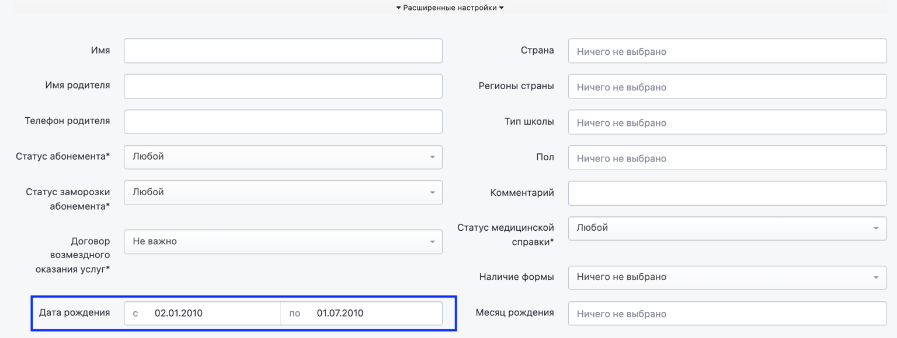
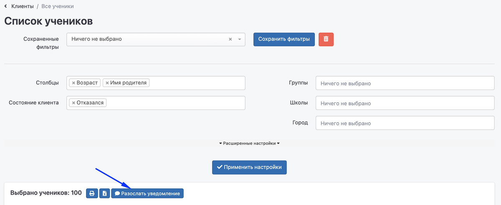
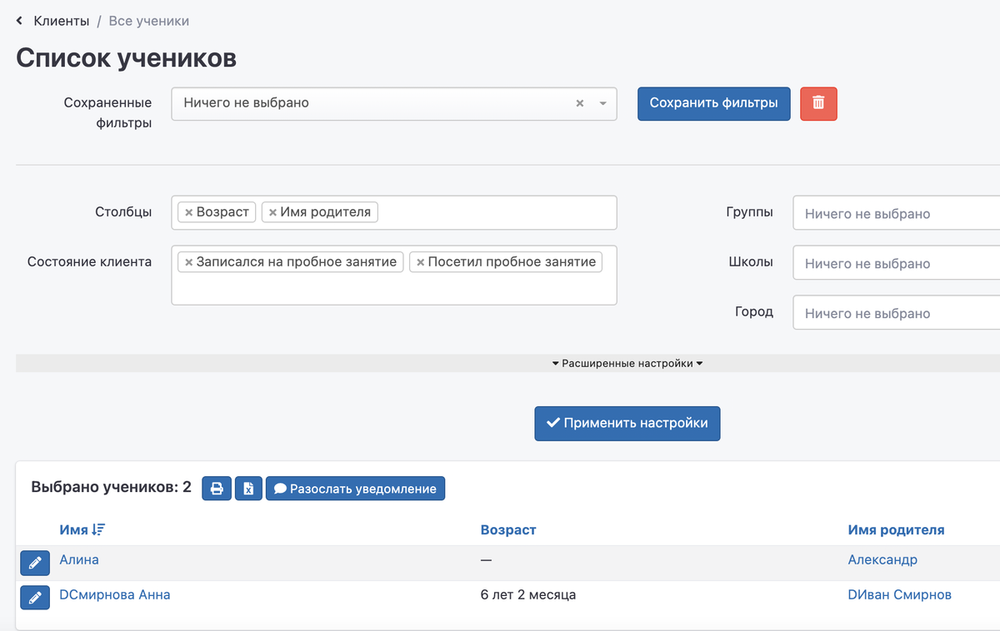

При переходе из главного меню **Клиенты -> Все ученики** можно получить список учеников, отфильтрованный по заданным параметрам.

**Сохранённые фильтры** позволяют один раз выставить настройки и использовать их для получения быстрого списка в дальнейшем.

{width=1536px height=851px}

**Столбцы** -- возможность выбрать те данные, которые будут отображены в таблице.

{width=1536px height=846px}

**Состояние клиента** -- возможность выбрать одно или несколько состояний, в которых в данный момент находится клиент - родитель в [воронке продаж](https://informa.gitbook.io/education-erp/klienty/sostoyanie-klientov).

{width=1536px height=846px}

**Группа, Школа** -- если у франчайзи несколько школ, то можно сформировать список учеников для одной из них либо выбрать нужную группу в школе.

Поле **Город** актуально для франчайзи, имеющих школы в разных городах.

**Расширенные настройки** позволяют использовать большее число фильтров.

:::info 

После выставления необходимых фильтров нужно нажать кнопку «Применить настройки».

:::

{width=1536px height=763px}

:::info 

Полученную таблицу можно отправить на печать или экспортировать в файл Excel. Также есть возможность разослать [уведомления](https://informa.gitbook.io/education-erp/uvedomleniya/rassylka-uvedomlenii) по выбранному списку учеников.

:::

{width=1536px height=611px}

#### **Примеры использования фильтров в списке учеников**

[tabs]

[tab:Покупка подарков]

В школе поздравляют учеников с днём рождения и дарят им небольшие подарки, как правило, их закупают заранее.

В списке учеников в поле столбцы: Возраст, Дата рождения, Группа.

В «Расширенных настройках» нужно выбрать даты = периоду дней рождения учеников. По кнопке "Применить настройки" сформирован список учеников, кому необходимо подготовить подарки.

{width=1536px height=633px}

{width=1536px height=580px}

[/tab]

[tab:Открытие нового филиала]

Франчайзи открывает новую школу и может пригласить клиентов, которые посещали ранее другой филиал. Для этого в поле «Состояние» нужно выбрать «Отказался» -- нажать «Применить настройки» и «Разослать уведомления».

{width=1200px height=492px}

[/tab]

[tab:Новая группа для девочек]

Франчайзи в рамках школы открывает дополнительную группу для девочек. Можно указать в поле «Состояние клиента» нужное значение/значения. Развернуть «Расширенные настройки» и выбрать значение для графы «Пол». Затем нажать «Применить настройки» и разослать уведомления -- приглашения в новую группу.

{width=1200px height=758px}

[/tab]

[/tabs]

