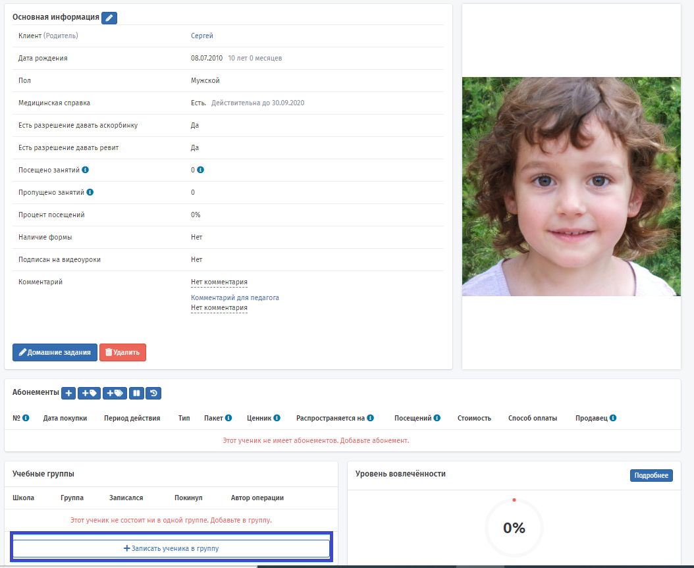
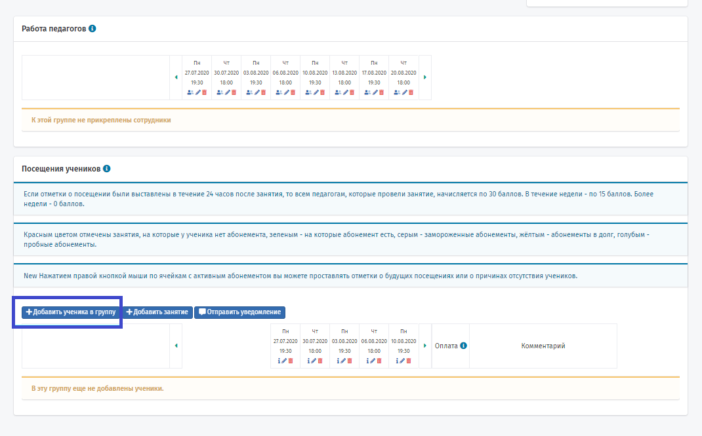
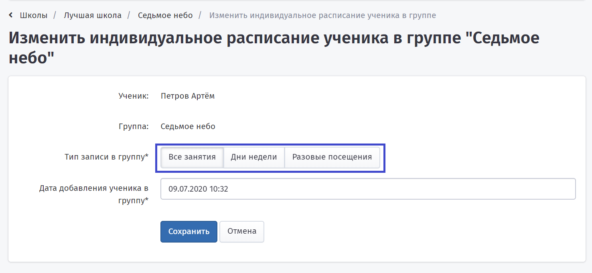

# Ученики

**Добавление учеников**&#x20;

Не стоит путать ученика с клиентом. [Клиент](klienty.md) - это взрослый человек, который платит за занятия. У одного клиента может быть несколько учеников.\
После регистрации клиента на странице его профиля нужно нажать кнопку "Добавить ученика".\
При заполнении карточки **Ученика** нужно обязательно указать его Фамилию, Имя и Пол.

\
Также можно указать:

* наличие медицинской справки и срок её действия,
* удобное время,
* район проживания и посещения занятий,
* оставить комментарий для франчайзи и педагога,
* подтвердить разрешение клиента давать ученику аскорбинку (используют, поощрение в некоторых школах),
* указать наличие формы (если это актуально для вашей школы).

Поле "Дата рождения" можно заполнить сразу или это сделает сам Клиент при первом входе в личный кабинет.\
Аналогично с фотографией, можете добавить ей самостоятельно или предложить установить Клиенту.\

**Личный кабинет клиента**

При первом входе в Личный кабинет Клиент подтверждает правильность данных по ученику, внесенных в систему Education ERP, может внести корректировки при необходимости (например, ошибка в имени).

**Добавление ученика в группу**

Далее Ученика нужно записать в учебную [группу](nachalo-raboty/shkola/gruppa/dobavlenie-grupp.md), в которой он будет посещать занятия. Один ученик может посещать занятия в нескольких группах. Обращаем внимание, что ученики записываются не в школу напрямую, а только в группы. Сделать это можно следующими способами:

1. Со страницы клиента

На странице Клиента в блоке Ученики нажмите на плюсик напротив фамилии ученика, затем выберите группу и нажмите кнопку "Добавить в группу". !!! Обратите внимание, если вы не добавляли ученика к клиенту, но ученик есть, значит этот клиент уже был в системе (ученик занимался в другой школе). Теперь, чтобы ученик "стал вашим учеником", нужно именно с этой страницы добавить его в группу.

.png>)

&#x20;   2\. Со страницы Ученика

На странице Ученика в блоке "Учебные группы" нажмите кнопку "Записать ученика в группу", затем выберите группу и нажмите кнопку "Добавить в группу".

&#x20;   3\. Со страницы группы

Перейдите на страницу группы (Управление школой -  Группы -  Кликнуть по названию группы) и в блоке Посещение учеников нажмите кнопочку "Добавить ученика в группу" . Появится выпадающий список, выберите ученика и нажмите кнопку "Добавить".

При добавлении ученика в группу нужно установить его расписание: все ли занятия по расписанию в группе он будет посещать, будет посещать занятия только по определенным дням или для него подходят только разовые посещения.

Наш ученик будет посещать все занятия по расписанию в группе "Седьмое небо", но всегда можно будет отредактировать его расписание в блоке "Посещения учеников" на странице [группы](nachalo-raboty/shkola/gruppa/dobavlenie-grupp.md).\
Первая отметка о посещении ученика будет отмечена синим цветом - отметка о бесплатном пробном занятии, если пробное занятие не было отмечено на странице клиента перед добавление ученика в группу.

.png>)

