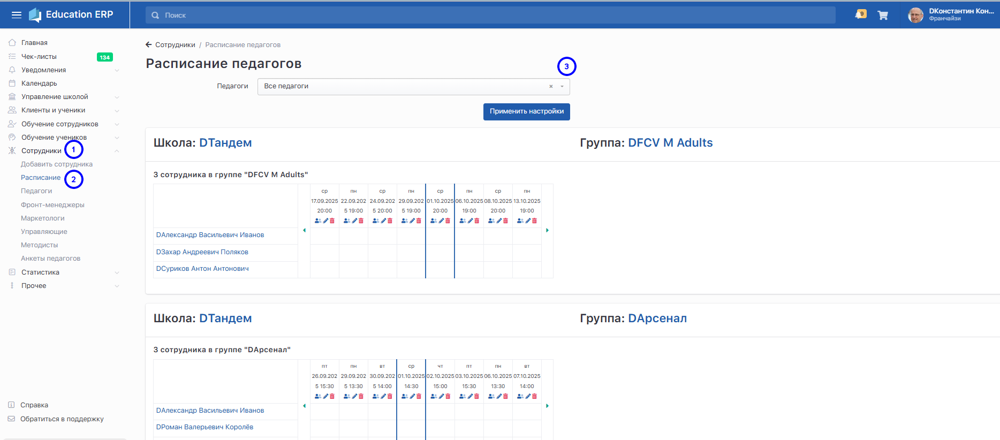
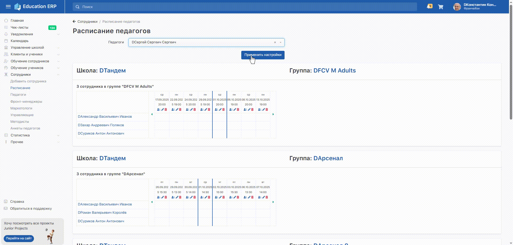

В системе **Education ERP** доступен удобный инструмент для просмотра и управления расписанием педагогов.

Перейдите из **Основного меню -> Сотрудники -> Расписание**.

## **Возможности страницы**

1. **Просмотр расписания.** По умолчанию отображается расписание всех педагогов школы. С помощью фильтра *Педагоги* можно выбрать конкретного сотрудника и посмотреть только его занятия.

   {width=1868px height=822px}

2. **Информация по группам.** В расписании видно школу, группу, педагогв, прикрёпленных к ней, даты и время занятий.

3. **Отметка педагога на занятии.** Прямо из расписания можно отметить, что педагог провёл занятие. Это помогает вести учёт посещаемости и работы сотрудников.

{width=1920px height=916px}