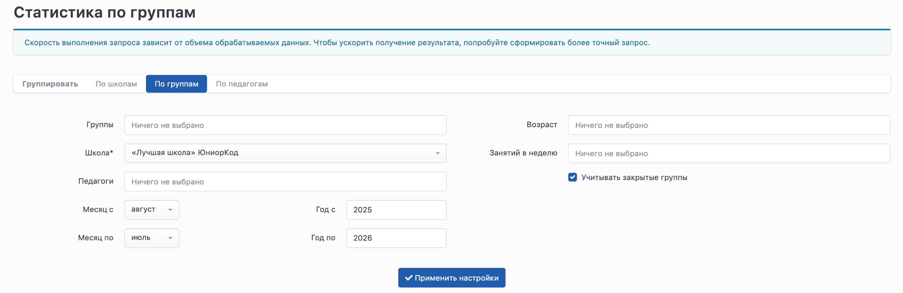
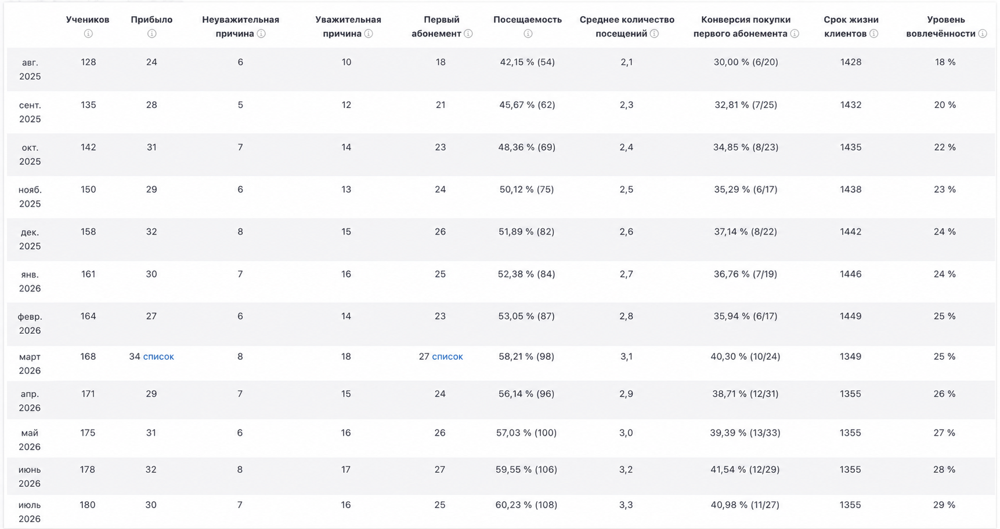
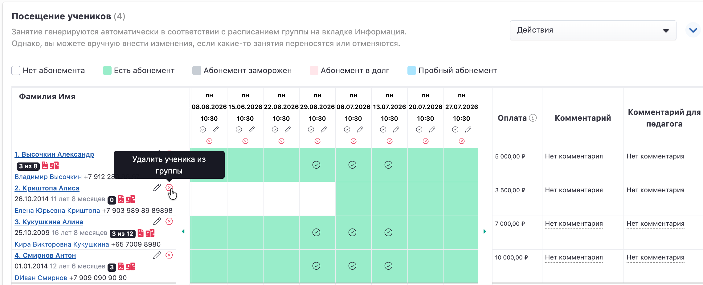
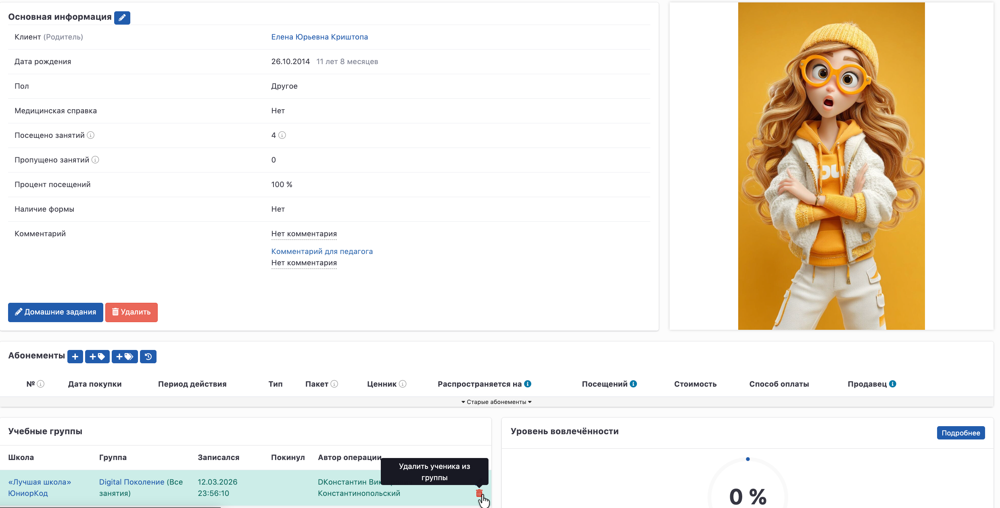

## Статистика по группам: удаление учеников из группы с указанием причины

**Статистика по группам** помогает анализировать состав групп, посещаемость и причины выбытия учеников.

Открыть отчет можно в разделе:

**Основное меню -> Статистика -> Управление школой -> Статистика по группам**

В отчете доступны три режима отображения:

-  По школам;

-  По группам;

-  По педагогам.

В этой статье рассмотрим вкладку **«По группам»**.

---

## Настройка отчета

Перед формированием отчета выберите необходимые параметры:

-  группу (необязательно);

-  школу;

-  педагога (необязательно);

-  возраст учеников (необязательно);

-  количество занятий в неделю (необязательно);

-  период формирования отчета.

При необходимости установите флажок **«Учитывать закрытые группы»**, чтобы в отчет попали архивные группы.

После выбора параметров нажмите **«Применить настройки»**.

{width=2469px height=804px}

---

## Показатели отчета

Для каждой группы отображаются следующие показатели.

### Учеников

Количество учеников, состоящих в группе **на момент окончания месяца**.

### Прибыло

Количество уникальных учеников, которые вступили в группу в выбранном месяце.

### Неуважительная причина

Количество учеников, которые были удалены из группы **по неуважительной причине**.

### Уважительная причина

Количество учеников, которые были удалены из группы **по уважительной причине**.

### Первый абонемент

Количество учеников, которые приобрели **первый абонемент**, действующий на данную группу, и продолжили обучение до конца месяца.

### Посещаемость

Процент посещенных занятий учениками, которые состояли в группе на конец месяца.

### Среднее количество посещений

Среднее количество посещений учениками, которые состояли в группе на конец месяца.

### Конверсия покупки первого абонемента

Процент учеников, которые приобрели первый абонемент после посещения пробного занятия.

### Срок жизни клиентов

Показатель рассчитывается для учеников, которые состояли в группе на конец месяца.

### Уровень вовлеченности

Показатель рассчитывается для учеников, которые состояли в группе на конец месяца.

{width=1723px height=913px}

---

## Как учитываются причины удаления учеников

Показатели **«Уважительная причина»** и **«Неуважительная причина»** формируются на основании причины, выбранной при удалении ученика из группы.

Удалить ученика можно:

-  на странице учебной группы на вкладке **«Посещение учеников»**;

-  из странице ученика в блоке **«Учебные группы»**.

{width=2281px height=928px}

{width=2479px height=1260px}

При удалении необходимо выбрать тип причины:

-  **Уважительная причина** -- если ученик покидает группу по причинам, не связанным с качеством работы школы (например, переезд, смена расписания, состояние здоровья, переход в другую группу и др.).

-  **Неуважительная причина** -- если уход связан с отказом от занятий, потерей интереса или другими причинами, не относящимися к уважительным.

После выбора типа причины укажите конкретную причину ухода и при необходимости добавьте комментарий.

:::quote 

**Важно.** От выбранного типа причины зависит, в каком столбце отчета будет учтен ученик -- **«Уважительная причина»** или **«Неуважительная причина»**.

:::

---

💡 **Совет**

Если вы анализируете статистику за прошлые периоды, рекомендуем включить параметр **«Учитывать закрытые группы»**. Это позволит получить полную картину по всем группам, включая уже закрытые.