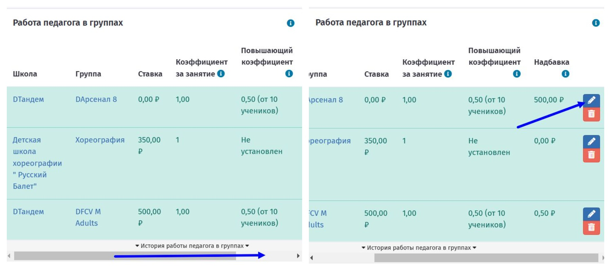

# Зарплаты сотрудников

## Где посмотреть начисления зарплаты сотрудникам?

Расчет начисления зарплаты сотрудников доступен на странице **Управление школой - Зарплаты - Начисления.**

<figure><figcaption></figcaption></figure>

Отображается помесячная информация по всем сотрудникам, есть возможность сформировать   начисления по конкретному сотруднику, а также экспортировать данные в Excel.

<figure><figcaption></figcaption></figure>

В блоке ниже доступна информация о начислении, выплате и детализации по **каждому** сотруднику.&#x20;

## Как начислить премию/штраф? Детализация начислений

На странице детализации заработка сотрудника есть возможность начисления премии/штрафа.&#x20;

Для указания штрафа необходимо ввести отрицательное значение, например, "-350".


В течение суток доступно самостоятельное удаление суммы штрафа или премии. По истечении этого времени, для удаления необходимо написать [**в техническую поддержку**](https://forms.yandex.ru/cloud/6616c14090fa7b1819ba1116/?clckid=5aea2dcb)**.** \
Важно **указать ФИО сотрудника, месяц начисления и сумму**, которую необходимо удалить.


В детализации по сотруднику можно проверить начисления по:&#x20;

* занятиям в группах,
* проведенным мероприятиям,
* штрафам и премиям,&#x20;

а также информацию по выплатам.\
На данной странице доступно начисление суммы и выплата. Для этого действия нажмите кнопку  "Начислить".

<figure><figcaption></figcaption></figure>

## Расчёт зарплаты и ставка


**Для верного расчета зарплаты необходимо указание и включение ставок сотрудникам.**


На странице сотрудников с ролью "Педагог" или "Фронт-менеджер" **необходимо указать ставку**, по которой в дальнейшем будет проходить расчет зарплаты.

На странице сотрудника с ролью "**Педагог**"  **важно включит галочки "Ставка включена"** и назначить стоимость этих ставок.&#x20;

Значение ставки - сумма, которая будет начислена педагогу за проведенное занятие.&#x20;

На занятии педагог может выполнять одну из ролей: Педагог, Старший педагог или Помощник педагога.​

<figure><figcaption></figcaption></figure>

<figure><figcaption></figcaption></figure>

Аналогично для сотрудников с ролью "**Фронт-менеджер**". На странице сотрудника в блоке Работа фронт-менеджера в школах, перейти в редактирование ставки.

<figure><figcaption></figcaption></figure>

Установить сумму ставки и процент с продажи абонементов. Обязательно установить галочку V "**Ставка включена**" и "Сохранить".

<figure><figcaption></figcaption></figure>

Также возможно указать ставку на странице группы. В блоке Педагоги перейти на страницу редактирования ставки.

<figure><figcaption></figcaption></figure>

## Отметка о работе педагога

Для расчета зарплаты на странице группы в блоке "Работа сотрудников"  на странице группы обязательно требуется проставлять отметку, если педагог провёл занятие. При выставлении отметки доступно указание роли: фронт-менеджер, помощник педагога, педагог, старший педагог.

<figure><figcaption></figcaption></figure>

***


**Для корректного расчета зарплаты сотрудникам с ролью Педагог и Фронт-менеджер важными условиями являются:**


* Указание ставки.
* Установка галочки "Ставка включена".
* Отметка работы сотрудника на странице группы.


**При отсутствии одного из пунктов зарплата не будет рассчитана.**

