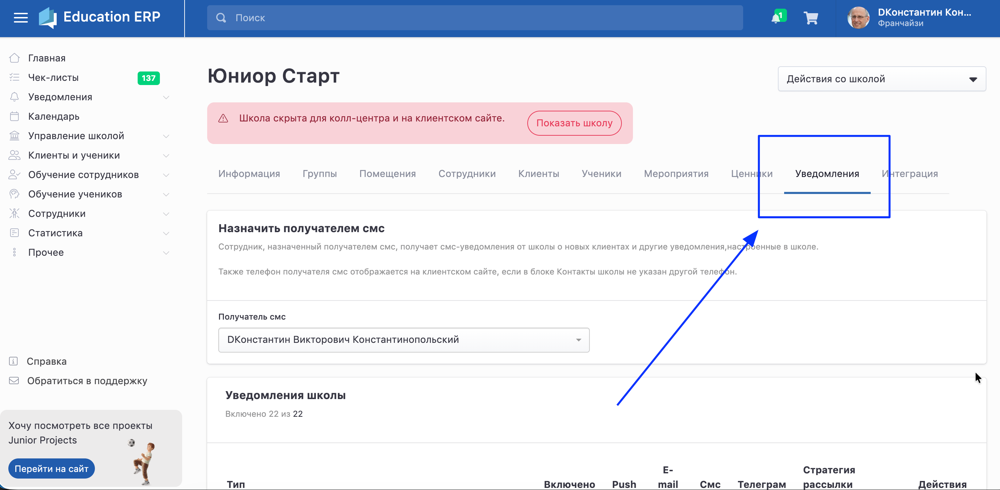
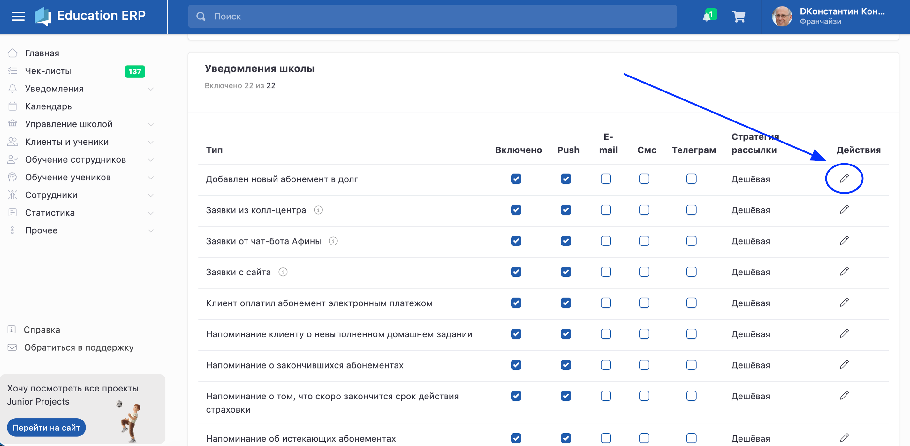
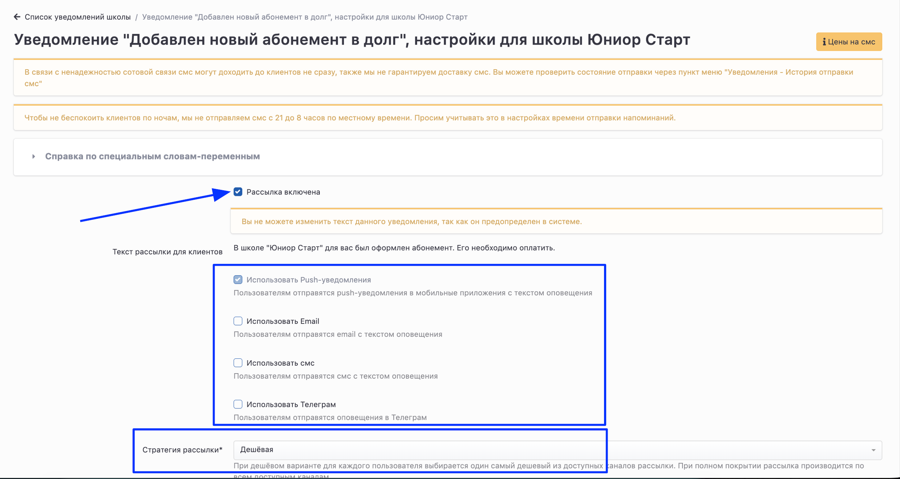

# Рассылка уведомлений

В системе есть **два** основных раздела  для рассылки уведомлений.

### **Раздел "Уведомлений" в главном меню**

В этом разделе можно:

-  создать  напоминание себе (например, позвонить Игорю завтра в 17:45, и система напомнит Вам);

-  сделать рассылку клиентам, ученикам и сотрудникам, используя фильтры для формирования списка получателей;

-  посмотреть статистику, по отправленным уведомлениям.

### **Блок "Уведомления" на странице школы**

В блоке "Уведомления" на странице школы  21 **автоматическая** рассылка,  действующая на постоянной основе. На момент создания школы все рассылки включены, но  уведомления  будут отправляться только **по бесплатным** [**каналам**](kanaly-rassylok).

Можно отключить или снова включить любую из рассылок, либо все рассылки. Для этого нужно перейти во вкладку Уведомления на странице школы.

{width=2877px height=1412px}

Нажать на карандашик напротив нужной рассылки.

{width=2850px height=1399px}

Включить  или отключить рассылку. Отметить [канал](kanaly-rassylok) и выбрать [стратегию ](strategiya-rassylki)рассылки уведомлений.

{width=2466px height=1314px}

:::info 

Настройку уведомлений нужно сделать для всех школ, если у вас их несколько.

:::

### Уведомления можно отправить со страниц:

-  [Список учеников](../ucheniki/spisok-uchenikov)

-  [Настраиваемый список клиентов](../klienty/nastraivaemyi-spisok-klientov)