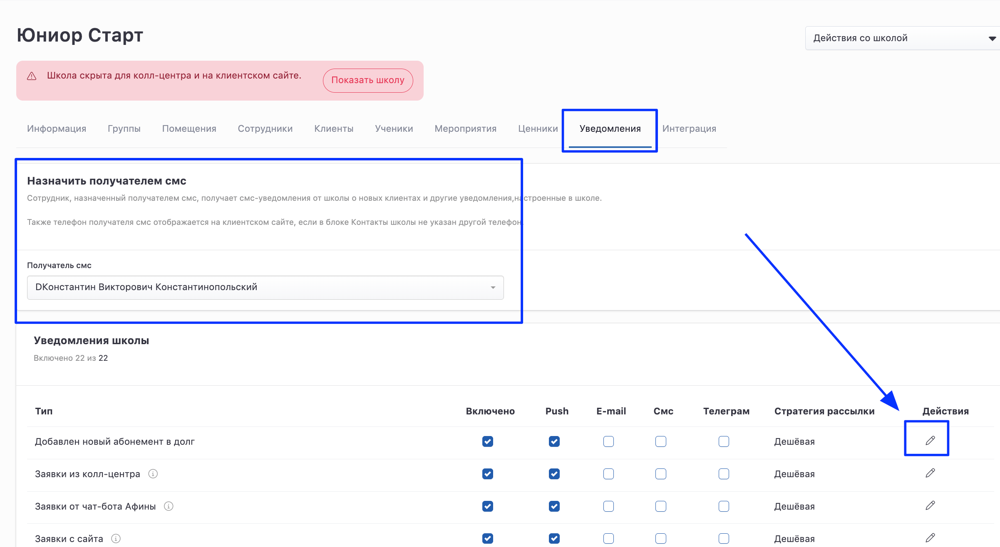
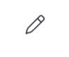
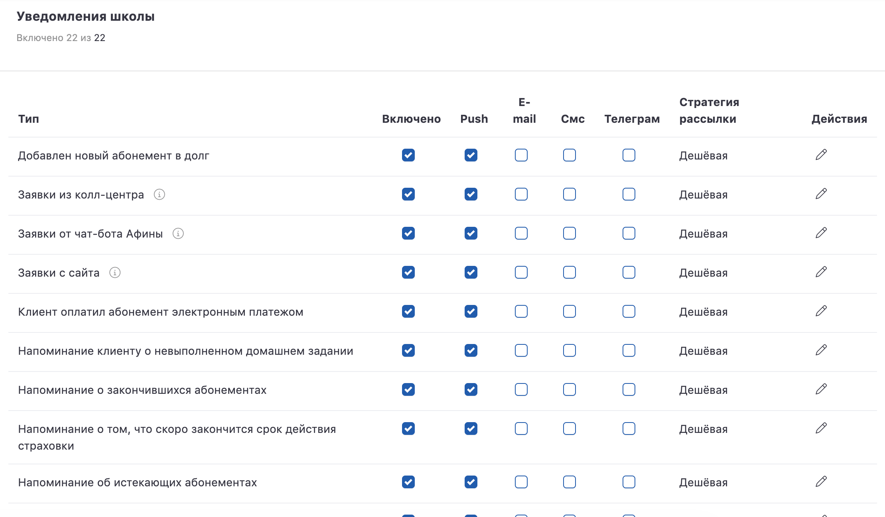

# Уведомления на странице школы

На странице школы во вкладке **Уведомления** доступна настройка уведомлений для каждой школы. 

Нужно указать получателя смс. По умолчанию это франчайзи. 

{width=2403px height=1316px}

Доступные уведомления для настройки:

-  Добавлен новый абонемент в долг: уведомление об абонемент в долг для оплаты

-  Заявки из колл-центра: уведомление, высылаемое менеджеру и клиенту о записи на пробное занятие через колл-центр

-  Заявки от чат-бота Афины: уведомление, высылаемое менеджеру и клиенту о записи на пробное занятие через чат-бота Афину

-  Заявки с сайта: уведомление, высылаемое менеджеру и клиенту о записи на пробное занятие через сайт

-  Клиент оплатил абонемент электронным платежом

-  Напоминание клиенту о невыполненном домашнем задании

-  Напоминание о закончившихся абонементах

-  Напоминание о том, что скоро закончится срок действия страховки

-  Напоминание об истекающих абонементах

-  Напоминание об истекающих медицинских справках

-  Напоминание об истекающих медицинских справках педагогов

-  Напоминание об окончании срока действия страховки

-  Напоминание об отсутствии страховки

-  Напоминания о занятии: уведомление о предстоящем занятии, высылаемое клиенту

-  Напоминания о мероприятиях: уведомление о предстоящем мероприятии, высылаемое клиенту

-  Напоминания о пробном занятии: уведомление о пробном занятии, высылаемое клиенту

-  Оповещение клиенту при покупке первого абонемента

-  Отправка клиентам конспекта занятия после его начала

-  Поздравление с днём рождения клиента

-  Поздравление с днём рождения ученика

-  Предупреждение о дне рождения

-  Уведомление об изменении в расписании группы

Необходимо настроить каждое из уведомлений. Это возможно сделать с помощью кнопки Редактировать {width=99px height=82px} напротив каждого типа уведомлений.

Откроется окно в котором необходимо:

1. Включить/выключить рассылку данного типа.

2. Указать текст рассылки для клиентов.

3. За какой период до события направлять уведомление.

4. [Каналы рассылки](https://informa.gitbook.io/education-erp/uvedomleniya/kanaly-rassylok).

5. [Стратегию рассылки](https://informa.gitbook.io/education-erp/uvedomleniya/strategiya-rassylki).

6. Сохранить настройку.

{width=2219px height=1297px}

:::info 

В связи с ненадежностью сотовой связи смс могут доходить до клиентов не сразу, также мы не гарантируем доставку смс. Вы можете проверить состояние отправки через пункт меню «Уведомления -> История отправки смс»

:::

:::info 

Чтобы не беспокоить клиентов по ночам, мы не отправляем смс c 21 до 8 часов по местному времени. Просим учитывать это в настройках времени отправки напоминаний.

:::

:::info 

Смс будут рассылаться только тем клиентам, ученики которых зачислены в группу выбранной школы, уже посетили хотя бы одно занятие, купили хотя бы один абонемент или их дата записи на пробное занятие не больше, чем дата ближайшего занятия.

:::

Теперь уведомления в рамках школы настроены.